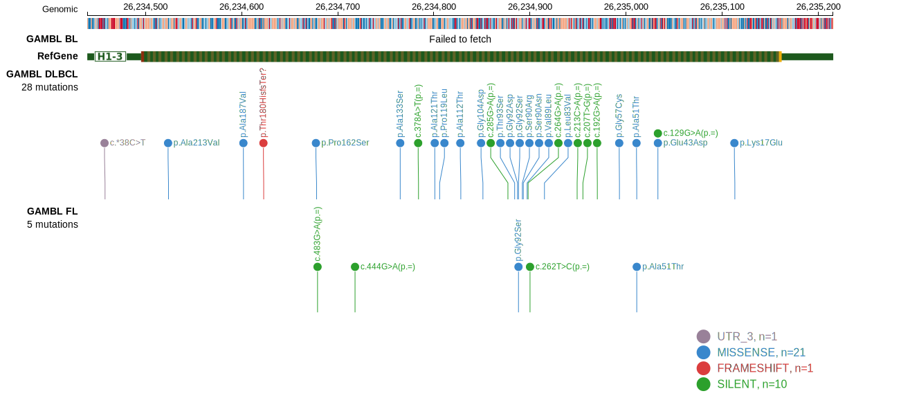

# [HIST1H1D]

## Mutation tier

|Entity|Tier|Description                           |
|:------:|:----:|--------------------------------------|
|BL    |2   |relevance in BL not firmly established|
|DLBCL |1   |high-confidence DLBCL gene            |
|FL    |1   |high-confidence FL gene               |
## Mutation incidence

|Entity|source               |frequency (%)|
|:------:|:---------------------:|:-------------:|
|BL    |GAMBL genomes+capture|3.23         |
|BL    |Thomas cohort        |4.70         |
|BL    |Panea cohort         |4.00         |
|DLBCL |GAMBL genomes        |6.12         |
|DLBCL |Schmitz cohort       |5.70         |
|DLBCL |Reddy cohort         |6.10         |
|DLBCL |Chapuy cohort        |7.70         |
|FL    |GAMBL genomes        |3.23         |

## Mutation pattern

|Entity|aSHM|Significant selection|dN/dS (missense)|dN/dS (nonsense)|
|:------:|:----:|:---------------------:|:----------------:|:----------------:|
|BL    |No  |No                   |8.064           |0               |
|DLBCL |No  |No                   |2.458           |0               |
|FL    |No  |No                   |0.857           |0               |

View coding variants in ProteinPaint [hg19](https://www.bcgsc.ca/downloads/morinlab/GAMBL/test/genes/HIST1H1D_protein.html)  or [hg38](https://www.bcgsc.ca/downloads/morinlab/GAMBL/test/genes/HIST1H1D_protein_hg38.html)

View all variants in GenomePaint [hg19](https://www.bcgsc.ca/downloads/morinlab/GAMBL/test/genes/HIST1H1D.html)

