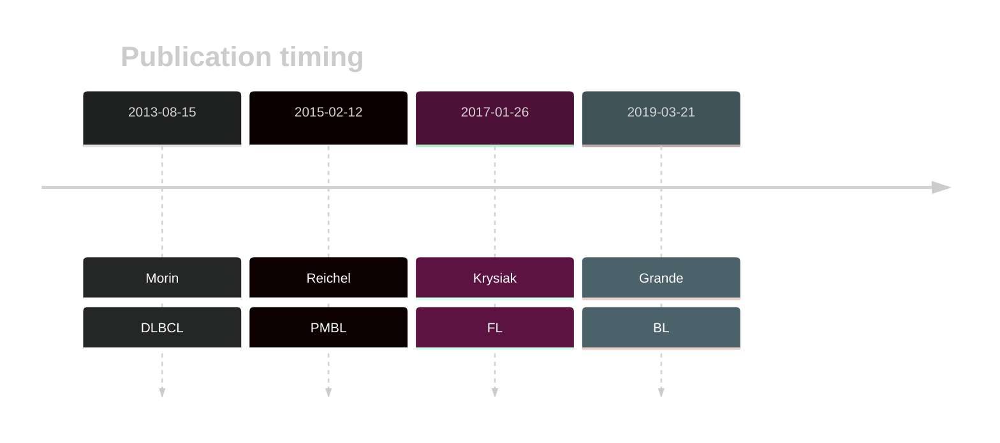

# HIST1H1E
## Overview
This is one of several genes that encode linker histone proteins that are recurrently mutated in DLBCL and FL.1,2 Mutations are often found in the globular domain of the protein, which is critical for its interaction with DNA and other histone proteins. 

## History
Mutations in this gene were first described in DLBCL in 2013 by Morin et al.3 Mutations were subsequently reported in FL in 2017 by Krysiak et al4 and in BL by Grande et al.5 

## Relevance tier by entity

|Entity|Tier|Description                           |
|:------:|:----:|--------------------------------------|
||1|high-confidence PMBL/cHL/GZL gene|
| |1   |high-confidence DLBCL gene            |
|    |1   |high-confidence FL gene               |
|    |2   |relevance in BL not firmly established|

## Mutation incidence in large patient cohorts (GAMBL reanalysis)

|Entity|source               |frequency (%)|
|:------:|:---------------------:|:-------------:|
|BL    |GAMBL genomes+capture| 9.70        |
|BL    |Thomas cohort        | 7.60        |
|BL    |Panea cohort         |19.80        |
|DLBCL |GAMBL genomes        |18.55        |
|DLBCL |Schmitz cohort       |17.87        |
|DLBCL |Reddy cohort         |14.51        |
|DLBCL |Chapuy cohort        |11.54        |
|FL    |GAMBL genomes        |12.93        |

## Mutation pattern and selective pressure estimates

|Entity|aSHM|Significant selection|dN/dS (missense)|dN/dS (nonsense)|
|:------:|:----:|:---------------------:|:----------------:|:----------------:|
|BL    |No  |Yes                  |14.203          |0.000           |
|DLBCL |No  |Yes                  | 4.446          |6.437           |
|FL    |No  |Yes                  |10.043          |0.000           |

 ## HIST1H1E Hotspots

| Chromosome |Coordinate (hg19) | ref>alt | HGVSp | 
 | :---:| :---: | :--: | :---: |
| chr6 | 26157090 | G>T | A158S |
| chr6 | 26157096 | A>C | K160Q |
| chr6 | 26157096 | A>G | K160E |
| chr6 | 26157099 | C>G | P161A |
| chr6 | 26157099 | C>T | P161S |
| chr6 | 26157102 | G>A | A162T |
| chr6 | 26157105 | G>A | A163T |
| chr6 | 26157106 | C>T | A163V |
| chr6 | 26157108 | G>A | A164T |
| chr6 | 26157108 | G>C | A164P |
| chr6 | 26157109 | C>G | A164G |
| chr6 | 26157109 | C>T | A164V |
| chr6 | 26157112 | C>G | A165G |
| chr6 | 26157112 | C>T | A165V |
| chr6 | 26157114 | G>A | G166R |
| chr6 | 26157118 | C>T | A167V |
| chr6 | 26157121 | A>T | K168I |
| chr6 | 26157139 | A>G | K174R |

View coding variants in ProteinPaint [hg19](https://morinlab.github.io/LLMPP/GAMBL/HIST1H1E_protein.html)  or [hg38](https://morinlab.github.io/LLMPP/GAMBL/HIST1H1E_protein_hg38.html)

View all variants in GenomePaint [hg19](https://morinlab.github.io/LLMPP/GAMBL/HIST1H1E.html)  or [hg38](https://morinlab.github.io/LLMPP/GAMBL/HIST1H1E_hg38.html)

## HIST1H1E Expression

## References
1. *Morin RD, Mendez-Lago M, Mungall AJ, Goya R, Mungall KL, Corbett RD, Johnson NA, Severson TM, Chiu R, Field M, Jackman S, Krzywinski M, Scott DW, Trinh DL, Tamura-Wells J, Li S, Firme MR, Rogic S, Griffith M, Chan S, Yakovenko O, Meyer IM, Zhao EY, Smailus D, Moksa M, Chittaranjan S, Rimsza L, Brooks-Wilson A, Spinelli JJ, Ben-Neriah S, Meissner B, Woolcock B, Boyle M, McDonald H, Tam A, Zhao Y, Delaney A, Zeng T, Tse K, Butterfield Y, Birol I, Holt R, Schein J, Horsman DE, Moore R, Jones SJ, Connors JM, Hirst M, Gascoyne RD, Marra MA. Frequent mutation of histone-modifying genes in non-Hodgkin lymphoma. Nature. 2011 Jul 27;476(7360):298-303. doi: 10.1038/nature10351. PMID: 21796119; PMCID: PMC3210554.*
2. *Li H, Kaminski MS, Li Y, Yildiz M, Ouillette P, Jones S, Fox H, Jacobi K, Saiya-Cork K, Bixby D, Lebovic D, Roulston D, Shedden K, Sabel M, Marentette L, Cimmino V, Chang AE, Malek SN. Mutations in linker histone genes HIST1H1 B, C, D, and E; OCT2 (POU2F2); IRF8; and ARID1A underlying the pathogenesis of follicular lymphoma. Blood. 2014 Mar 6;123(10):1487-98. doi: 10.1182/blood-2013-05-500264. Epub 2014 Jan 16. PMID: 24435047; PMCID: PMC4729540.*
3. *Morin RD, Mungall K, Pleasance E, Mungall AJ, Goya R, Huff RD, Scott DW, Ding J, Roth A, Chiu R, Corbett RD, Chan FC, Mendez-Lago M, Trinh DL, Bolger-Munro M, Taylor G, Hadj Khodabakhshi A, Ben-Neriah S, Pon J, Meissner B, Woolcock B, Farnoud N, Rogic S, Lim EL, Johnson NA, Shah S, Jones S, Steidl C, Holt R, Birol I, Moore R, Connors JM, Gascoyne RD, Marra MA. Mutational and structural analysis of diffuse large B-cell lymphoma using whole-genome sequencing. Blood. 2013 Aug 15;122(7):1256–1265. PMCID: PMC3744992*
4.  *Krysiak K, Gomez F, White BS, Matlock M, Miller CA, Trani L, Fronick CC, Fulton RS, Kreisel F, Cashen AF, Carson KR, Berrien-Elliott MM, Bartlett NL, Griffith M, Griffith OL, Fehniger TA. Recurrent somatic mutations affecting B-cell receptor signaling pathway genes in follicular lymphoma. Blood. 2017 Jan 26;129(4):473–483. PMCID: PMC5270390*

5.  *Grande BM, Gerhard DS, Jiang A, Griner NB, Abramson JS, Alexander TB, Allen H, Ayers LW, Bethony JM, Bhatia K, Bowen J, Casper C, Choi JK, Culibrk L, Davidsen TM, Dyer MA, Gastier-Foster JM, Gesuwan P, Greiner TC, Gross TG, Hanf B, Harris NL, He Y, Irvin JD, Jaffe ES, Jones SJM, Kerchan P, Knoetze N, Leal FE, Lichtenberg TM, Ma Y, Martin JP, Martin MR, Mbulaiteye SM, Mullighan CG, Mungall AJ, Namirembe C, Novik K, Noy A, Ogwang MD, Omoding A, Orem J, Reynolds SJ, Rushton CK, Sandlund JT, Schmitz R, Taylor C, Wilson WH, Wright GW, Zhao EY, Marra MA, Morin RD, Staudt LM. Genome-wide discovery of somatic coding and noncoding mutations in pediatric endemic and sporadic Burkitt lymphoma. Blood. 2019 Mar 21;133(12):1313–1324.* 

<!-- ORIGIN: 23699601 -->
<!-- BL: grandeGenomewideDiscoverySomatic2019 -->
<!-- FL: krysiakRecurrentSomaticMutations2017b -->
<!-- DLBCL: morinMutationalStructuralAnalysis2013 -->
<!-- PMBL: reichelFlowSortingExome2015a -->
