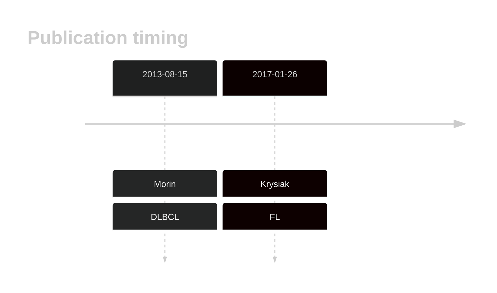
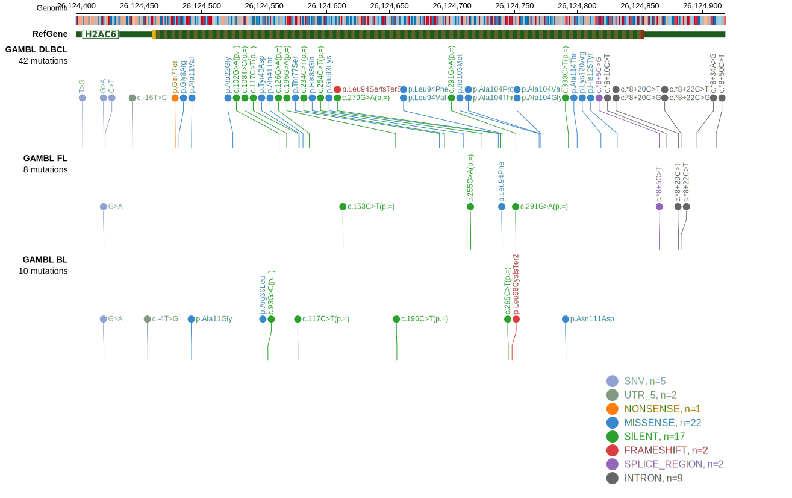

# HIST1H2AC
This gene encodes the H2A protein, one of the core proteins comprising nucleosomes. Although relatively common in DLBCL, little is known about the function of these mutations. 
 ## History

## Relevance tier by entity

|Entity|Tier|Description               |
|:------:|:----:|--------------------------|
| |1   |high-confidence DLBCL gene|
|    |1   |high-confidence FL gene   |

## Mutation incidence in large patient cohorts (GAMBL reanalysis)

|Entity|source        |frequency (%)|
|:------:|:--------------:|:-------------:|
|DLBCL |GAMBL genomes |5.16         |
|DLBCL |Schmitz cohort|6.17         |
|DLBCL |Reddy cohort  |3.40         |
|DLBCL |Chapuy cohort |6.41         |
|FL    |GAMBL genomes |2.31         |

## Mutation pattern and selective pressure estimates

|Entity|aSHM|Significant selection|dN/dS (missense)|dN/dS (nonsense)|
|:------:|:----:|:---------------------:|:----------------:|:----------------:|
|BL    |No  |No                   |1.742           | 0.000          |
|DLBCL |No  |No                   |3.090           |20.364          |
|FL    |No  |No                   |1.715           | 0.000          |

> [!NOTE]
> First described in DLBCL in 2013 by [Morin RD](https://pubmed.ncbi.nlm.nih.gov/23699601)

 ## HIST1H2AC Hotspots

| Chromosome |Coordinate (hg19) | ref>alt | HGVSp | 
 | :---:| :---: | :--: | :---: |
| chr6 | 26124549 | G>T | R30L |
| chr6 | 26124560 | CTGCTCCG>- | L34* |
| chr6 | 26124578 | T>G | Y40D |
| chr6 | 26124581 | G>A | A41T |
| chr6 | 26124690 | C>G | T77S |
| chr6 | 26124709 | C>G | H83Q |
| chr6 | 26124737 | G>A | E93K |
| chr6 | 26124740 | C>G | L94V |
| chr6 | 26124740 | C>T | L94F |
| chr6 | 26124767 | A>G | I103V |
| chr6 | 26124769 | T>G | I103M |
| chr6 | 26124770 | G>A | A104T |
| chr6 | 26124770 | G>C | A104P |
| chr6 | 26124771 | C>G | A104G |
| chr6 | 26124771 | C>T | A104V |
| chr6 | 26124791 | A>G | N111D |
| chr6 | 26124800 | G>A | A114T |
| chr6 | 26124819 | A>G | K120R |
| chr6 | 26124832 | CC>TT | H125Y |

View coding variants in ProteinPaint [hg19](https://morinlab.github.io/LLMPP/GAMBL/HIST1H2AC_protein.html)  or [hg38](https://morinlab.github.io/LLMPP/GAMBL/HIST1H2AC_protein_hg38.html)

View all variants in GenomePaint [hg19](https://morinlab.github.io/LLMPP/GAMBL/HIST1H2AC.html)  or [hg38](https://morinlab.github.io/LLMPP/GAMBL/HIST1H2AC_hg38.html)

## HIST1H2AC Expression

<!-- ORIGIN: morinMutationalStructuralAnalysis2013 -->
<!-- FL: krysiakRecurrentSomaticMutations2017b -->
<!-- DLBCL: morinMutationalStructuralAnalysis2013 -->
## References
1.  Morin RD, Mungall K, Pleasance E, Mungall AJ, Goya R, Huff RD, Scott DW, Ding J, Roth A, Chiu R, Corbett RD, Chan FC, Mendez-Lago M, Trinh DL, Bolger-Munro M, Taylor G, Hadj Khodabakhshi A, Ben-Neriah S, Pon J, Meissner B, Woolcock B, Farnoud N, Rogic S, Lim EL, Johnson NA, Shah S, Jones S, Steidl C, Holt R, Birol I, Moore R, Connors JM, Gascoyne RD, Marra MA. Mutational and structural analysis of diffuse large B-cell lymphoma using whole-genome sequencing. Blood. 2013 Aug 15;122(7):1256–1265. PMCID: PMC3744992
2.  Krysiak K, Gomez F, White BS, Matlock M, Miller CA, Trani L, Fronick CC, Fulton RS, Kreisel F, Cashen AF, Carson KR, Berrien-Elliott MM, Bartlett NL, Griffith M, Griffith OL, Fehniger TA. Recurrent somatic mutations affecting B-cell receptor signaling pathway genes in follicular lymphoma. Blood. 2017 Jan 26;129(4):473–483. PMCID: PMC5270390
