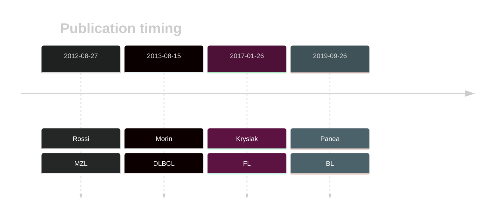
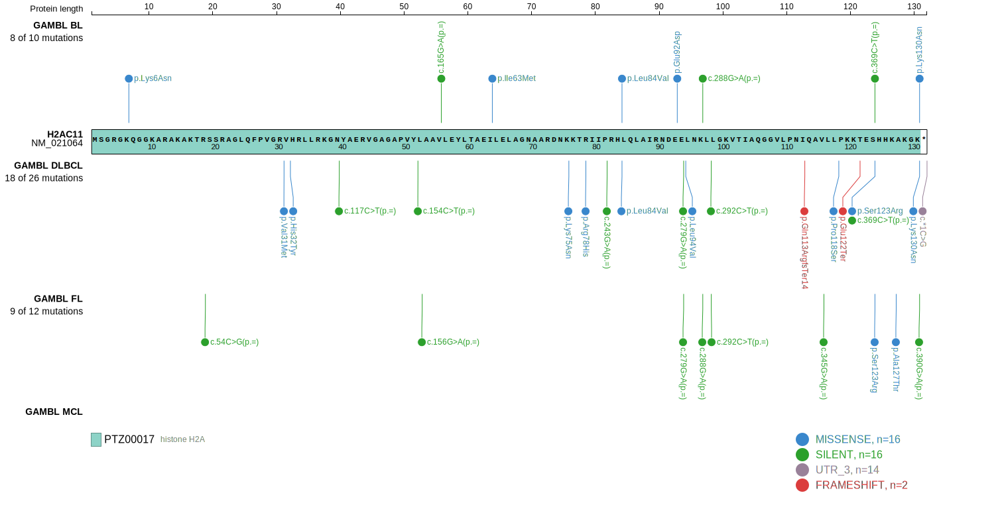
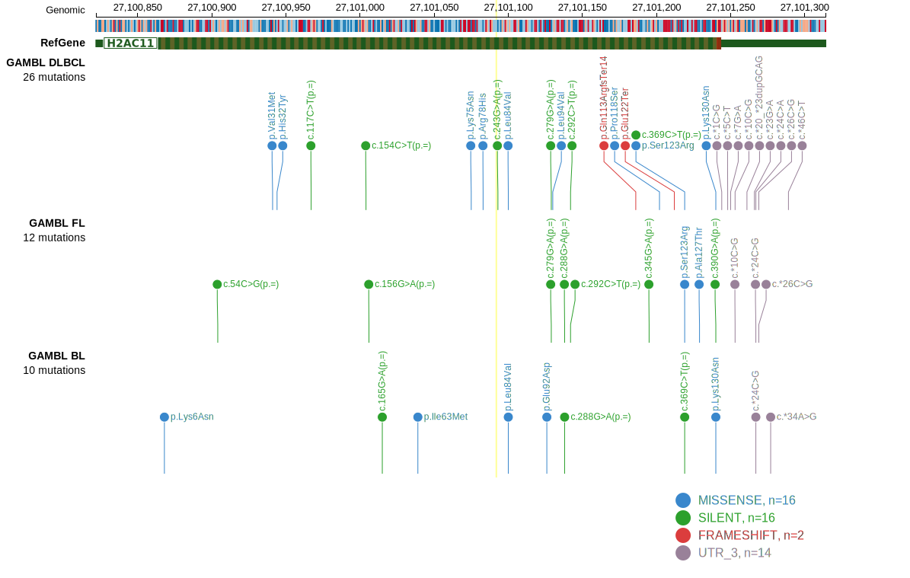

# HIST1H2AG

## History

## Relevance tier by entity

|Entity|Tier|Description                              |
|:------:|:----:|-----------------------------------------|
||2|relevance in MZL not firmly established|
|    |2   |relevance in BL not firmly established   |
| |2   |relevance in DLBCL not firmly established|
|    |1   |high-confidence FL gene                  |

## Mutation incidence in large patient cohorts (GAMBL reanalysis)

|Entity|source               |frequency (%)|
|:------:|:---------------------:|:-------------:|
|BL    |GAMBL genomes+capture|1.39         |
|BL    |Thomas cohort        |2.50         |
|BL    |Panea cohort         |1.00         |
|DLBCL |GAMBL genomes        |3.44         |
|DLBCL |Schmitz cohort       |3.62         |
|DLBCL |Reddy cohort         |1.90         |
|DLBCL |Chapuy cohort        |2.99         |
|FL    |GAMBL genomes        |2.08         |

## Mutation pattern and selective pressure estimates

|Entity|aSHM|Significant selection|dN/dS (missense)|dN/dS (nonsense)|
|:------:|:----:|:---------------------:|:----------------:|:----------------:|
|BL    |No  |No                   |3.809           |0               |
|DLBCL |No  |No                   |5.602           |0               |
|FL    |No  |No                   |0.405           |0               |

 ## HIST1H2AG Hotspots

| Chromosome |Coordinate (hg19) | ref>alt | HGVSp | 
 | :---:| :---: | :--: | :---: |
| chr6 | 27101075 | G>T | K75N |
| chr6 | 27101083 | G>A | R78H |
| chr6 | 27101100 | C>G | L84V |
| chr6 | 27101126 | G>T | E92D |
| chr6 | 27101130 | C>G | L94V |

View coding variants in ProteinPaint [hg19](https://morinlab.github.io/LLMPP/GAMBL/HIST1H2AG_protein.html)  or [hg38](https://morinlab.github.io/LLMPP/GAMBL/HIST1H2AG_protein_hg38.html)

View all variants in GenomePaint [hg19](https://morinlab.github.io/LLMPP/GAMBL/HIST1H2AG.html)  or [hg38](https://morinlab.github.io/LLMPP/GAMBL/HIST1H2AG_hg38.html)

## HIST1H2AG Expression

<!-- ORIGIN: rossiCodingGenomeSplenic2012c -->
<!-- MZL: rossiCodingGenomeSplenic2012c -->
<!-- DLBCL: morinMutationalStructuralAnalysis2013 -->
<!-- BL: paneaWholeGenomeLandscape2019 -->
<!-- FL: krysiakRecurrentSomaticMutations2017b -->

## References
1.  Rossi D, Trifonov V, Fangazio M, Bruscaggin A, Rasi S, Spina V, Monti S, Vaisitti T, Arruga F, Famà R, Ciardullo C, Greco M, Cresta S, Piranda D, Holmes A, Fabbri G, Messina M, Rinaldi A, Wang J, Agostinelli C, Piccaluga PP, Lucioni M, Tabbò F, Serra R, Franceschetti S, Deambrogi C, Daniele G, Gattei V, Marasca R, Facchetti F, Arcaini L, Inghirami G, Bertoni F, Pileri SA, Deaglio S, Foà R, Dalla-Favera R, Pasqualucci L, Rabadan R, Gaidano G. The coding genome of splenic marginal zone lymphoma: activation of NOTCH2 and other pathways regulating marginal zone development. J Exp Med. 2012 Aug 27;209(9):1537–1551. PMCID: PMC3428941
2.  Morin RD, Mungall K, Pleasance E, Mungall AJ, Goya R, Huff RD, Scott DW, Ding J, Roth A, Chiu R, Corbett RD, Chan FC, Mendez-Lago M, Trinh DL, Bolger-Munro M, Taylor G, Hadj Khodabakhshi A, Ben-Neriah S, Pon J, Meissner B, Woolcock B, Farnoud N, Rogic S, Lim EL, Johnson NA, Shah S, Jones S, Steidl C, Holt R, Birol I, Moore R, Connors JM, Gascoyne RD, Marra MA. Mutational and structural analysis of diffuse large B-cell lymphoma using whole-genome sequencing. Blood. 2013 Aug 15;122(7):1256–1265. PMCID: PMC3744992
3.  Krysiak K, Gomez F, White BS, Matlock M, Miller CA, Trani L, Fronick CC, Fulton RS, Kreisel F, Cashen AF, Carson KR, Berrien-Elliott MM, Bartlett NL, Griffith M, Griffith OL, Fehniger TA. Recurrent somatic mutations affecting B-cell receptor signaling pathway genes in follicular lymphoma. Blood. 2017 Jan 26;129(4):473–483. PMCID: PMC5270390
4.  Panea R, Love C, Shingleton JR, Reddy A, Bailey J, Moormann A, Otieno J, Ong’echa J, Oduor C, Schroêder K, Masalu N, Chao N, Agajanian M, Major M, Fedoriw Y, Richards K, Rymkiewicz G, Miles R, Alobeid B, Bhagat G, Flowers C, Ondrejka S, Hsi E, Choi W, Au-Yeung R, Hartmann W, Lenz G, Meyerson H, Lin YY, Zhuang Y, Luftig M, Waldrop A, Dave T, Thakkar D, Sahay H, Li G, Palus B, Seshadri V, Kim S, Gascoyne R, Levy S, Mukhopadhyay M, Dunson D, Dave S. The whole genome landscape of Burkitt lymphoma subtypes. Blood. 2019; 
