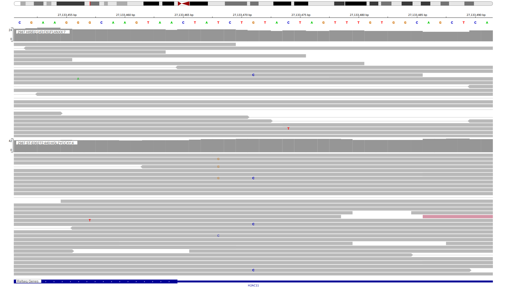

# HIST1H2AG

<<Warn("The variants reported in BL in this gene failed QC")>>

**[See below ](#representative-mutations) or [the study page ](papers/paneaWholeGenomeLandscape2019.md#tier-2) for more information**

## History

## Relevance tier by entity

|Entity|Tier|Description                              |
|:------:|:----:|-----------------------------------------|
||2|relevance in MZL not firmly established[@rossiCodingGenomeSplenic2012c]|
|    |3  | Retired, Failed QC[@paneaWholeGenomeLandscape2019]|
| |2   |relevance in DLBCL not firmly established|
|    |1   |high-confidence FL gene                  |

## Mutation incidence in large patient cohorts (GAMBL reanalysis)

|Entity|source               |frequency (%)|
|:------:|:---------------------:|:-------------:|
|BL    |GAMBL genomes+capture|1.39         |
|BL    |Thomas cohort        |2.50         |
|BL    |Panea cohort         |1.00         |
|DLBCL |GAMBL genomes        |3.44         |
|DLBCL |Schmitz cohort       |3.62         |
|DLBCL |Reddy cohort         |1.90         |
|DLBCL |Chapuy cohort        |2.99         |
|FL    |GAMBL genomes        |2.08         |

## Mutation pattern and selective pressure estimates

|Entity|aSHM|Significant selection|dN/dS (missense)|dN/dS (nonsense)|
|:------:|:----:|:---------------------:|:----------------:|:----------------:|
|BL    |No  |No                   |3.809           |0               |
|DLBCL |No  |No                   |5.602           |0               |
|FL    |No  |No                   |0.405           |0               |

## HIST1H2AG Hotspots

| Chromosome |Coordinate (hg19) | ref>alt | HGVSp | 
 | :---:| :---: | :--: | :---: |
| chr6 | 27101075 | G>T | K75N |
| chr6 | 27101083 | G>A | R78H |
| chr6 | 27101100 | C>G | L84V |
| chr6 | 27101126 | G>T | E92D |
| chr6 | 27101130 | C>G | L94V |

View coding variants in ProteinPaint [hg19](https://morinlab.github.io/LLMPP/GAMBL/HIST1H2AG_protein.html)  or [hg38](https://morinlab.github.io/LLMPP/GAMBL/HIST1H2AG_protein_hg38.html)

View all variants in GenomePaint [hg19](https://morinlab.github.io/LLMPP/GAMBL/HIST1H2AG.html)  or [hg38](https://morinlab.github.io/LLMPP/GAMBL/HIST1H2AG_hg38.html)

<!-- ORIGIN: rossiCodingGenomeSplenic2012c -->
<!-- MZL: rossiCodingGenomeSplenic2012c -->
<!-- DLBCL: morinMutationalStructuralAnalysis2013 -->
<!-- BL: paneaWholeGenomeLandscape2019 -->
<!-- FL: krysiakRecurrentSomaticMutations2017b -->

## Representative Mutations

### BL4

&starf; &starf; &starf; &star; &star;

&starf; &star; &star; &star; &star;

&starf; &star; &star; &star; &star;

## All Mutations

### DLBCL[@morinMutationalStructuralAnalysis2013]

[RG130](https://www.bcgsc.ca/downloads/morinlab/GAMBL/Morin_2013/RG130.html)
[RG142](https://www.bcgsc.ca/downloads/morinlab/GAMBL/Morin_2013/RG142.html)

## References
