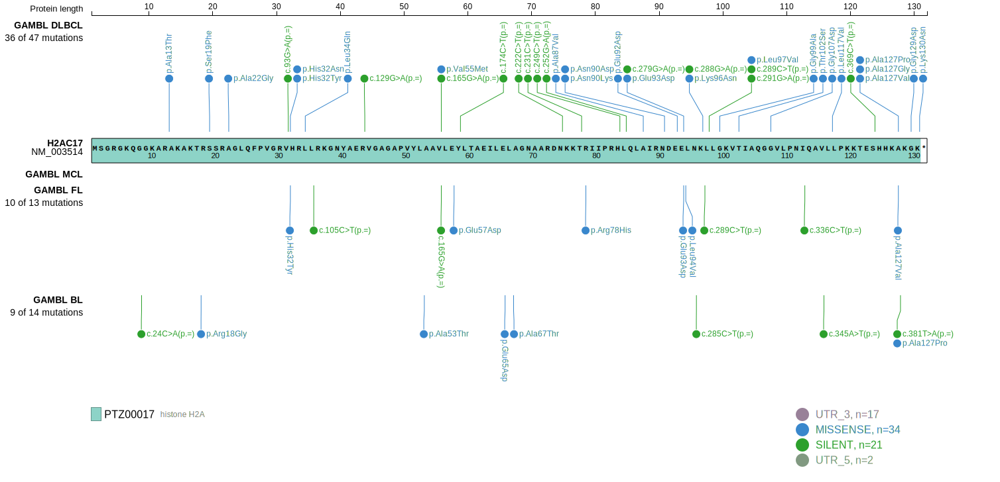
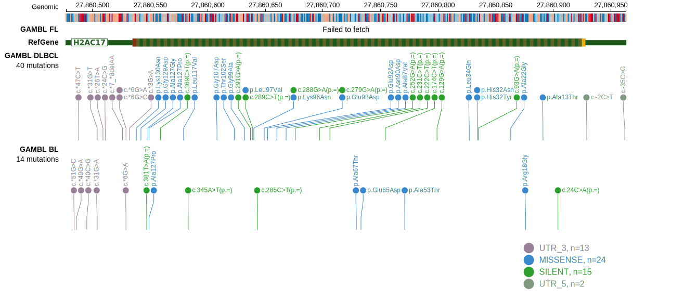

# [HIST1H2AM]

## Mutation tier

|Entity|Tier|Description                           |
|:------:|:----:|--------------------------------------|
|BL    |2   |relevance in BL not firmly established|
|DLBCL |1   |high-confidence DLBCL gene            |
|FL    |1   |high-confidence FL gene               |
## Mutation incidence

|Entity|source               |frequency (%)|
|:------:|:---------------------:|:-------------:|
|BL    |GAMBL genomes+capture|1.85         |
|BL    |Thomas cohort        |1.70         |
|BL    |Panea cohort         |3.00         |
|DLBCL |GAMBL genomes        |5.93         |
|DLBCL |Schmitz cohort       |5.70         |
|DLBCL |Reddy cohort         |4.80         |
|DLBCL |Chapuy cohort        |6.00         |
|FL    |GAMBL genomes        |3.70         |

## Mutation pattern

|Entity|aSHM|Significant selection|dN/dS (missense)|dN/dS (nonsense)|
|:------:|:----:|:---------------------:|:----------------:|:----------------:|
|BL    |No  |No                   |2.149           |0               |
|DLBCL |No  |No                   |1.844           |0               |
|FL    |No  |No                   |1.845           |0               |

> [!NOTE]
> First described in BL in 2019 by [Panea RI](https://pubmed.ncbi.nlm.nih.gov/31558468)

View coding variants in ProteinPaint [hg19](https://www.bcgsc.ca/downloads/morinlab/GAMBL/test/genes/HIST1H2AM_protein.html)  or [hg38](https://www.bcgsc.ca/downloads/morinlab/GAMBL/test/genes/HIST1H2AM_protein_hg38.html)

View all variants in GenomePaint [hg19](https://www.bcgsc.ca/downloads/morinlab/GAMBL/test/genes/HIST1H2AM.html)  or [hg38](https://www.bcgsc.ca/downloads/morinlab/GAMBL/test/genes/HIST1H2AM_hg38.html)

