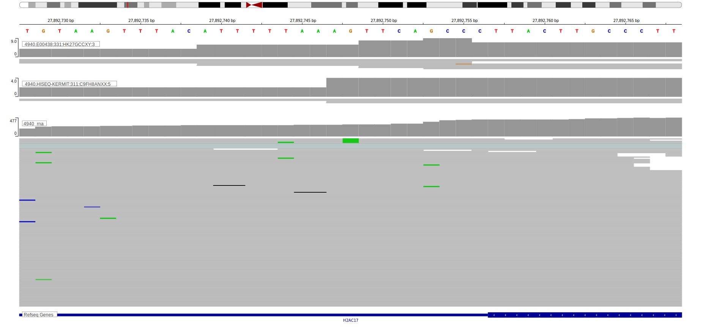

# HIST1H2AM

<<Warn("The variants reported in this gene failed QC")>>

**[See below ](#representative-mutations) or [the study page ](papers/paneaWholeGenomeLandscape2019.md#tier-2) for more information**

## Overview
This gene encodes the H2A protein, one of the core proteins comprising nucleosomes. Although relatively common in DLBCL, little is known about the function of these mutations. 

## History

## Relevance tier by entity

|Entity|Tier|Description                           |
|:------:|:----:|--------------------------------------|
| |1   |high-confidence DLBCL gene            |
|    |1   |high-confidence FL gene               |
|    |2   |relevance in BL not firmly established|

## Mutation incidence in large patient cohorts (GAMBL reanalysis)

|Entity|source               |frequency (%)|
|:------:|:---------------------:|:-------------:|
|DLBCL |GAMBL genomes        |5.93         |
|DLBCL |Schmitz cohort       |5.74         |
|DLBCL |Reddy cohort         |4.80         |
|DLBCL |Chapuy cohort        |5.98         |
|FL    |GAMBL genomes        |3.70         |
|BL    |GAMBL genomes+capture|1.85         |
|BL    |Thomas cohort        |1.70         |
|BL    |Panea cohort         |3.00         |

## Mutation pattern and selective pressure estimates

|Entity|aSHM|Significant selection|dN/dS (missense)|dN/dS (nonsense)|
|:------:|:----:|:---------------------:|:----------------:|:----------------:|
|DLBCL |No  |No                   |1.844           |0               |
|FL    |No  |No                   |1.845           |0               |
|BL    |No  |No                   |2.149           |0               |

## HIST1H2AM Hotspots

| Chromosome |Coordinate (hg19) | ref>alt | HGVSp | 
 | :---:| :---: | :--: | :---: |
|chr6|27860660|T>C|N90D| 
|chr6|27860658|G>C|N90K| 
|chr6|27860652|C>G|E92D| 
|chr6|27860652|C>A|E92D|
|chr6|27860649|C>G|E93D| 
|chr6|27860648|G>C|L94V| 
|chr6|27860648|G>A|L94F| 
|chr6|27860644|T>C|N95S| 
|chr6|27860643|G>C|N95K| 
|chr6|27860640|C>G|K96N| 
|chr6|27860640|C>A|K96N| 
|chr6|27860639|G>C|L97V| 
|chr6|27860636|G>C|L98V| 
|chr6|27860636|G>A|L98F| 
|chr6|27860633|C>G|G99R| 
|chr6|27860632|C>G|G99A| 
|chr6|27860627|C>G|V101L| 
|chr6|27860627|C>T|V101I| 
|chr6|27860627|C>A|V101F| 
|chr6|27860624|T>A|T102S| 
|chr6|27860623|G>C|T102S| 
|chr6|27860623|G>A|T102I| 
|chr6|27860560|C>G|S123T| 
|chr6|27860559|G>C|S123R| 
| chr6 | 27860549 | C>G | A127P |
| chr6 | 27860548 | G>C | A127G |
| chr6 | 27860548 | G>A | A127V |
| chr6 | 27860542 | C>T | G129D |
| chr6 | 27860538 | C>G | K130N |

View coding variants in ProteinPaint [hg19](https://morinlab.github.io/LLMPP/GAMBL/HIST1H2AM_protein.html)  or [hg38](https://morinlab.github.io/LLMPP/GAMBL/HIST1H2AM_protein_hg38.html)

View all variants in GenomePaint [hg19](https://morinlab.github.io/LLMPP/GAMBL/HIST1H2AM.html)  or [hg38](https://morinlab.github.io/LLMPP/GAMBL/HIST1H2AM_hg38.html)

<!-- ORIGIN: krysiakRecurrentSomaticMutations2017b -->
<!-- FL: krysiakRecurrentSomaticMutations2017b -->
<!-- BL: paneaWholeGenomeLandscape2019 -->

## Representative Mutations

### BL2

&star; &star; &star; &star; &star;

&star; &star; &star; &star; &star;

## References
1.  Krysiak K, Gomez F, White BS, Matlock M, Miller CA, Trani L, Fronick CC, Fulton RS, Kreisel F, Cashen AF, Carson KR, Berrien-Elliott MM, Bartlett NL, Griffith M, Griffith OL, Fehniger TA. Recurrent somatic mutations affecting B-cell receptor signaling pathway genes in follicular lymphoma. Blood. 2017 Jan 26;129(4):473–483. PMCID: PMC5270390
2.  Panea R, Love C, Shingleton JR, Reddy A, Bailey J, Moormann A, Otieno J, Ong’echa J, Oduor C, Schroêder K, Masalu N, Chao N, Agajanian M, Major M, Fedoriw Y, Richards K, Rymkiewicz G, Miles R, Alobeid B, Bhagat G, Flowers C, Ondrejka S, Hsi E, Choi W, Au-Yeung R, Hartmann W, Lenz G, Meyerson H, Lin YY, Zhuang Y, Luftig M, Waldrop A, Dave T, Thakkar D, Sahay H, Li G, Palus B, Seshadri V, Kim S, Gascoyne R, Levy S, Mukhopadhyay M, Dunson D, Dave S. The whole genome landscape of Burkitt lymphoma subtypes. Blood. 2019; 
