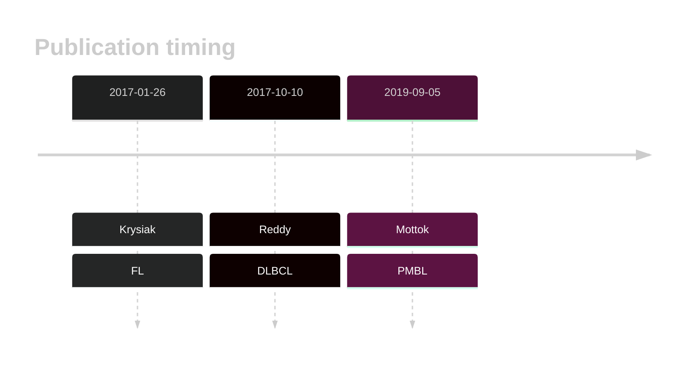

# HIST1H2BC

## Overview
This gene encodes the H2A protein, one of the core proteins comprising nucleosomes. Although relatively common in DLBCL, little is known about the function of these mutations. 
## History

## Relevance tier by entity

|Entity|Tier|Description               |
|:------:|:----:|--------------------------|
||2|relevance in PMBL/cHL/GZL not firmly established|
| |1   |high-confidence DLBCL gene|
|    |1   |high-confidence FL gene   |

## Mutation incidence in large patient cohorts (GAMBL reanalysis)

|Entity|source        |frequency (%)|
|:------:|:--------------:|:-------------:|
|DLBCL |GAMBL genomes |4.59         |
|DLBCL |Schmitz cohort|5.53         |
|DLBCL |Reddy cohort  |4.30         |
|DLBCL |Chapuy cohort |5.56         |
|FL    |GAMBL genomes |3.46         |

## Mutation pattern and selective pressure estimates

|Entity|aSHM|Significant selection|dN/dS (missense)|dN/dS (nonsense)|
|:------:|:----:|:---------------------:|:----------------:|:----------------:|
|BL    |No  |No                   |2.806           |35.161          |
|DLBCL |No  |No                   |1.712           | 0.000          |
|FL    |No  |No                   |1.094           | 0.000          |

 ## HIST1H2BC Hotspots

| Chromosome |Coordinate (hg19) | ref>alt | HGVSp | 
 | :---:| :---: | :--: | :---: |
| chr6 | 26123951 | C>T | G61D |
| chr6 | 26123944 | C>T | M63I |
|chr6|26123939|G>A|S65F| 
|chr6|26123939|G>C|S65C| 
|chr6|26123924|A>G|I70T| 
|chr6|26123923|T>C|I70M| 
|chr6|26123922|A>C|F71V| 
|chr6|26123920|A>C|F71L| 
|chr6|26123919|C>G|E72Q| 
|chr6|26123919|C>T|E72K| 
|chr6|26123917|C>G|E72D| 
|chr6|26123916|G>C|R73G|
|chr6|26123916|G>A|R73C| 
|chr6|26123915|C>T|R73H| 
|chr6|26123904|C>T|E77K| 
|chr6|26123903|T>C|E77G| 
|chr6|26123901|C>T|A78T| 
|chr6|26123901|C>A|A78S| 
|chr6|26123900|G>A|A78V| 
| chr6 | 26123886 | G>A | H83Y |
| chr6 | 26123881 | G>C | Y84* |
| chr6 | 26123874 | G>A | R87C |

View coding variants in ProteinPaint [hg19](https://morinlab.github.io/LLMPP/GAMBL/HIST1H2BC_protein.html)  or [hg38](https://morinlab.github.io/LLMPP/GAMBL/HIST1H2BC_protein_hg38.html)

View all variants in GenomePaint [hg19](https://morinlab.github.io/LLMPP/GAMBL/HIST1H2BC.html)  or [hg38](https://morinlab.github.io/LLMPP/GAMBL/HIST1H2BC_hg38.html)

## HIST1H2BC Expression

<!-- ORIGIN: reddyGeneticFunctionalDrivers2017 -->
<!-- PMBL: mottokIntegrativeGenomicAnalysis2019b -->
<!-- FL: krysiakRecurrentSomaticMutations2017b -->
<!-- DLBCL: reddyGeneticFunctionalDrivers2017 -->

## References
1.  Krysiak K, Gomez F, White BS, Matlock M, Miller CA, Trani L, Fronick CC, Fulton RS, Kreisel F, Cashen AF, Carson KR, Berrien-Elliott MM, Bartlett NL, Griffith M, Griffith OL, Fehniger TA. Recurrent somatic mutations affecting B-cell receptor signaling pathway genes in follicular lymphoma. Blood. 2017 Jan 26;129(4):473–483. PMCID: PMC5270390
2.  Reddy A, Zhang J, Davis NS, Moffitt AB, Love CL, Waldrop A, Leppa S, Pasanen A, Meriranta L, Karjalainen-Lindsberg ML, Nørgaard P, Pedersen M, Gang AO, Høgdall E, Heavican TB, Lone W, Iqbal J, Qin Q, Li G, Kim SY, Healy J, Richards KL, Fedoriw Y, Bernal-Mizrachi L, Koff JL, Staton AD, Flowers CR, Paltiel O, Goldschmidt N, Calaminici M, Clear A, Gribben J, Nguyen E, Czader MB, Ondrejka SL, Collie A, Hsi ED, Tse E, Au-Yeung RKH, Kwong YL, Srivastava G, Choi WWL, Evens AM, Pilichowska M, Sengar M, Reddy N, Li S, Chadburn A, Gordon LI, Jaffe ES, Levy S, Rempel R, Tzeng T, Happ LE, Dave T, Rajagopalan D, Datta J, Dunson DB, Dave SS. Genetic and Functional Drivers of Diffuse Large B Cell Lymphoma. Cell. 2017 Oct;171(2):481-494.e15. 
3.  Mottok A, Hung SS, Chavez EA, Woolcock B, Telenius A, Chong LC, Meissner B, Nakamura H, Rushton C, Viganò E, Sarkozy C, Gascoyne RD, Connors JM, Ben-Neriah S, Mungall A, Marra MA, Siebert R, Scott DW, Savage KJ, Steidl C. Integrative genomic analysis identifies key pathogenic mechanisms in primary mediastinal large B-cell lymphoma. Blood. 2019 Sep 5;134(10):802–813. PMID: 31292115
