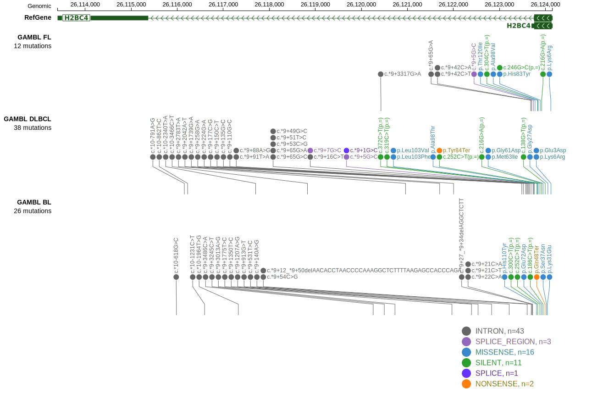

# HIST1H2BC

## Relevance tier by entity

|Entity|Tier|Description               |
|:------:|:----:|--------------------------|
|DLBCL |1   |high-confidence DLBCL gene|
|FL    |1   |high-confidence FL gene   |

## Mutation incidence in large patient cohorts (GAMBL reanalysis)

|Entity|source        |frequency (%)|
|:------:|:--------------:|:-------------:|
|DLBCL |GAMBL genomes |4.59         |
|DLBCL |Schmitz cohort|5.53         |
|DLBCL |Reddy cohort  |4.30         |
|DLBCL |Chapuy cohort |5.56         |
|FL    |GAMBL genomes |3.46         |

## Mutation pattern and selective pressure estimates

|Entity|aSHM|Significant selection|dN/dS (missense)|dN/dS (nonsense)|
|:------:|:----:|:---------------------:|:----------------:|:----------------:|
|BL    |No  |No                   |2.806           |35.161          |
|DLBCL |No  |No                   |1.712           | 0.000          |
|FL    |No  |No                   |1.094           | 0.000          |

> [!NOTE]
> First described in DLBCL in 2017 by [Reddy A](https://pubmed.ncbi.nlm.nih.gov/28985567)

 ## HIST1H2BC Hotspots

| Chromosome |Coordinate (hg19) | ref>alt | HGVSp | 
 | :---:| :---: | :--: | :---: |
| chr6 | 26123951 | C>T | G61D |
| chr6 | 26123944 | C>T | M63I |
| chr6 | 26123917 | C>G | E72D |
| chr6 | 26123886 | G>A | H83Y |
| chr6 | 26123881 | G>C | Y84* |
| chr6 | 26123874 | G>A | R87C |

View coding variants in ProteinPaint [hg19](https://morinlab.github.io/LLMPP/GAMBL/HIST1H2BC_protein.html)  or [hg38](https://morinlab.github.io/LLMPP/GAMBL/HIST1H2BC_protein_hg38.html)

View all variants in GenomePaint [hg19](https://morinlab.github.io/LLMPP/GAMBL/HIST1H2BC.html)  or [hg38](https://morinlab.github.io/LLMPP/GAMBL/HIST1H2BC_hg38.html)

