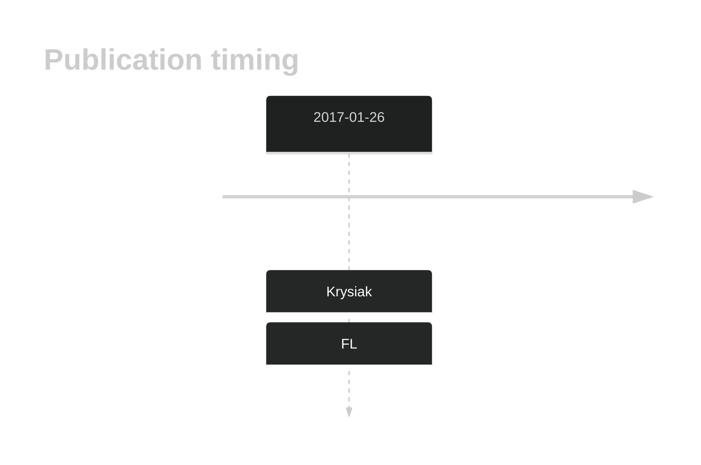

# HIST1H2BG

## History

## Relevance tier by entity

|Entity|Tier|Description            |
|:------:|:----:|-----------------------|
|    |1   |high-confidence FL gene[@krysiakRecurrentSomaticMutations2017b]|

## Mutation incidence in large patient cohorts (GAMBL reanalysis)

|Entity|source       |frequency (%)|
|:------:|:-------------:|:-------------:|
|FL    |GAMBL genomes|2.08         |

## Mutation pattern and selective pressure estimates

|Entity|aSHM|Significant selection|dN/dS (missense)|dN/dS (nonsense)|
|:------:|:----:|:---------------------:|:----------------:|:----------------:|
|BL    |No  |No                   |1.350           |0               |
|DLBCL |No  |No                   |3.197           |0               |
|FL    |No  |No                   |1.211           |0               |

View coding variants in ProteinPaint [hg19](https://morinlab.github.io/LLMPP/GAMBL/HIST1H2BG_protein.html)  or [hg38](https://morinlab.github.io/LLMPP/GAMBL/HIST1H2BG_protein_hg38.html)

View all variants in GenomePaint [hg19](https://morinlab.github.io/LLMPP/GAMBL/HIST1H2BG.html)  or [hg38](https://morinlab.github.io/LLMPP/GAMBL/HIST1H2BG_hg38.html)

## HIST1H2BG Expression

<!-- ORIGIN: krysiakRecurrentSomaticMutations2017b -->
<!-- FL: krysiakRecurrentSomaticMutations2017b -->

## References
