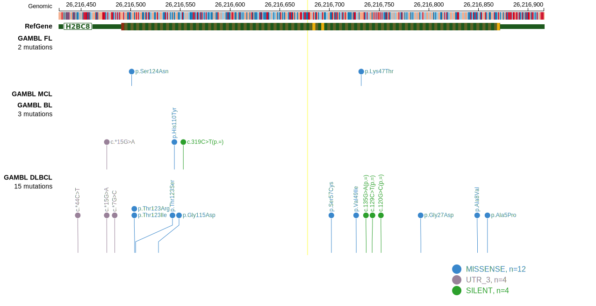

# [HIST1H2BG]

## Mutation tier

|Entity|Tier|Description            |
|:------:|:----:|-----------------------|
|FL    |1   |high-confidence FL gene|
## Mutation incidence

|Entity|source       |frequency (%)|
|:------:|:-------------:|:-------------:|
|FL    |GAMBL genomes|2.08         |

## Mutation pattern

|Entity|aSHM|Significant selection|dN/dS (missense)|dN/dS (nonsense)|
|:------:|:----:|:---------------------:|:----------------:|:----------------:|
|BL    |No  |No                   |1.350           |0               |
|DLBCL |No  |No                   |3.197           |0               |
|FL    |No  |No                   |1.211           |0               |

View coding variants in ProteinPaint [hg19](https://www.bcgsc.ca/downloads/morinlab/GAMBL/test/genes/HIST1H2BG_protein.html)  or [hg38](https://www.bcgsc.ca/downloads/morinlab/GAMBL/test/genes/HIST1H2BG_protein_hg38.html)

View all variants in GenomePaint [hg19](https://www.bcgsc.ca/downloads/morinlab/GAMBL/test/genes/HIST1H2BG.html)

