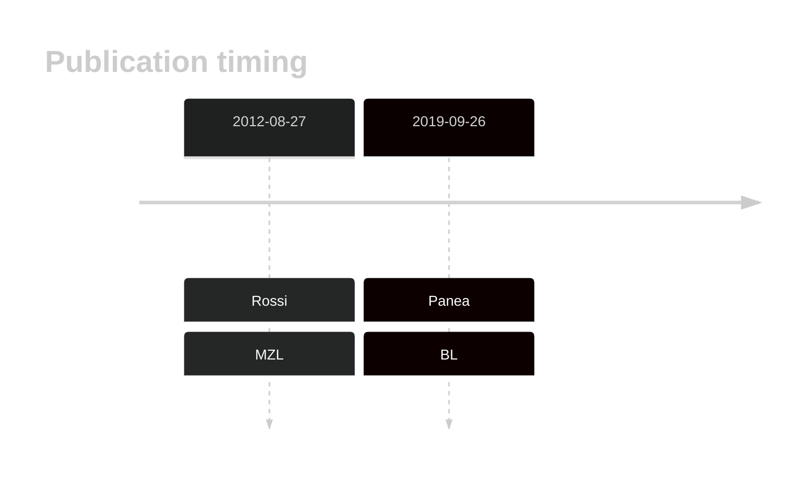

# HIST1H2BK

## Overview
This gene encodes the H2A protein, one of the core proteins comprising nucleosomes. Although relatively common in DLBCL, little is known about the function of these mutations. 
## History

## Relevance tier by entity

|Entity|Tier|Description                           |
|:------:|:----:|--------------------------------------|
||2|relevance in MZL not firmly established|
|    |2   |relevance in BL not firmly established|
| |1   |high-confidence DLBCL gene            |

## Mutation incidence in large patient cohorts (GAMBL reanalysis)

|Entity|source               |frequency (%)|
|:------:|:---------------------:|:-------------:|
|BL    |GAMBL genomes+capture|5.31         |
|BL    |Thomas cohort        |4.70         |
|BL    |Panea cohort         |7.90         |
|DLBCL |GAMBL genomes        |4.59         |
|DLBCL |Schmitz cohort       |5.32         |
|DLBCL |Reddy cohort         |4.20         |
|DLBCL |Chapuy cohort        |5.56         |

## Mutation pattern and selective pressure estimates

|Entity|aSHM|Significant selection|dN/dS (missense)|dN/dS (nonsense)|
|:------:|:----:|:---------------------:|:----------------:|:----------------:|
|BL    |No  |No                   |4.421           |0               |
|DLBCL |No  |No                   |1.567           |0               |
|FL    |No  |No                   |0.760           |0               |

View coding variants in ProteinPaint [hg19](https://morinlab.github.io/LLMPP/GAMBL/HIST1H2BK_protein.html)  or [hg38](https://morinlab.github.io/LLMPP/GAMBL/HIST1H2BK_protein_hg38.html)

View all variants in GenomePaint [hg19](https://morinlab.github.io/LLMPP/GAMBL/HIST1H2BK.html)  or [hg38](https://morinlab.github.io/LLMPP/GAMBL/HIST1H2BK_hg38.html)

## HIST1H2BK Expression

<!-- ORIGIN: rossiCodingGenomeSplenic2012c -->
<!-- MZL: rossiCodingGenomeSplenic2012c -->
<!-- BL: paneaWholeGenomeLandscape2019 -->

## References
1.  Rossi D, Trifonov V, Fangazio M, Bruscaggin A, Rasi S, Spina V, Monti S, Vaisitti T, Arruga F, Famà R, Ciardullo C, Greco M, Cresta S, Piranda D, Holmes A, Fabbri G, Messina M, Rinaldi A, Wang J, Agostinelli C, Piccaluga PP, Lucioni M, Tabbò F, Serra R, Franceschetti S, Deambrogi C, Daniele G, Gattei V, Marasca R, Facchetti F, Arcaini L, Inghirami G, Bertoni F, Pileri SA, Deaglio S, Foà R, Dalla-Favera R, Pasqualucci L, Rabadan R, Gaidano G. The coding genome of splenic marginal zone lymphoma: activation of NOTCH2 and other pathways regulating marginal zone development. J Exp Med. 2012 Aug 27;209(9):1537–1551. PMCID: PMC3428941
2.  Panea R, Love C, Shingleton JR, Reddy A, Bailey J, Moormann A, Otieno J, Ong’echa J, Oduor C, Schroêder K, Masalu N, Chao N, Agajanian M, Major M, Fedoriw Y, Richards K, Rymkiewicz G, Miles R, Alobeid B, Bhagat G, Flowers C, Ondrejka S, Hsi E, Choi W, Au-Yeung R, Hartmann W, Lenz G, Meyerson H, Lin YY, Zhuang Y, Luftig M, Waldrop A, Dave T, Thakkar D, Sahay H, Li G, Palus B, Seshadri V, Kim S, Gascoyne R, Levy S, Mukhopadhyay M, Dunson D, Dave S. The whole genome landscape of Burkitt lymphoma subtypes. Blood. 2019; 
