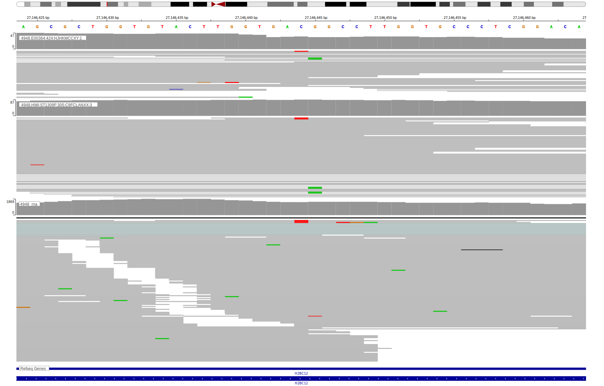

# HIST1H2BK

## Overview

This gene encodes the H2A protein, one of the core proteins comprising nucleosomes. Although relatively common in DLBCL, little is known about the function of these mutations. 

## History

## Relevance tier by entity

|Entity|Tier|Description                           |
|:------:|:----:|--------------------------------------|
||2|relevance in MZL not firmly established[@rossiCodingGenomeSplenic2012c]|
|    |2-F   |Failed QC|
| |1   |high-confidence DLBCL gene            |

## Mutation incidence in large patient cohorts (GAMBL reanalysis)

|Entity|source               |frequency (%)|
|:------:|:---------------------:|:-------------:|
|BL    |GAMBL genomes+capture|5.31         |
|BL    |Thomas cohort        |4.70         |
|BL    |Panea cohort         |7.90         |
|DLBCL |GAMBL genomes        |4.59         |
|DLBCL |Schmitz cohort       |5.32         |
|DLBCL |Reddy cohort         |4.20         |
|DLBCL |Chapuy cohort        |5.56         |

## Mutation pattern and selective pressure estimates

|Entity|aSHM|Significant selection|dN/dS (missense)|dN/dS (nonsense)|
|:------:|:----:|:---------------------:|:----------------:|:----------------:|
|BL    |No  |No                   |4.421           |0               |
|DLBCL |No  |No                   |1.567           |0               |
|FL    |No  |No                   |0.760           |0               |

View coding variants in ProteinPaint [hg19](https://morinlab.github.io/LLMPP/GAMBL/HIST1H2BK_protein.html)  or [hg38](https://morinlab.github.io/LLMPP/GAMBL/HIST1H2BK_protein_hg38.html)

View all variants in GenomePaint [hg19](https://morinlab.github.io/LLMPP/GAMBL/HIST1H2BK.html)  or [hg38](https://morinlab.github.io/LLMPP/GAMBL/HIST1H2BK_hg38.html)

<!-- ORIGIN: rossiCodingGenomeSplenic2012c -->
<!-- MZL: rossiCodingGenomeSplenic2012c -->
<!-- BL: paneaWholeGenomeLandscape2019 -->

## Representative Mutations

### BL2

**Rating**
&starf; &star; &star; &star; &star;

**Rating**
&starf; &star; &star; &star; &star;

## References
