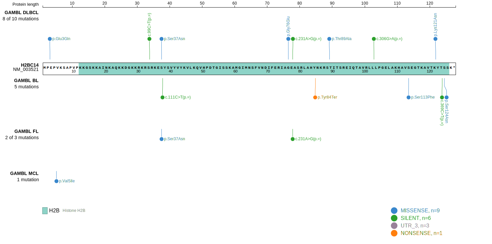
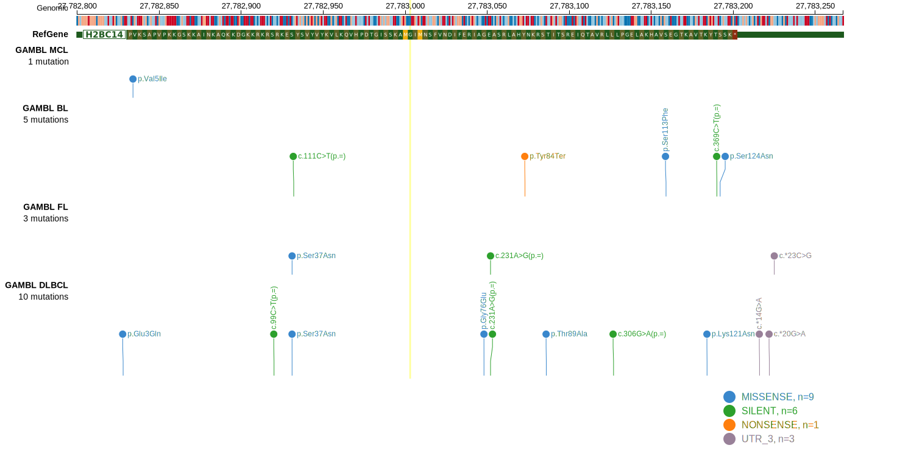

# [HIST1H2BM]

## Mutation tier

|Entity|Tier|Description                           |
|:------:|:----:|--------------------------------------|
|FL    |2   |relevance in FL not firmly established|
## Mutation incidence

|Entity|source       |frequency (%)|
|:------:|:-------------:|:-------------:|
|FL    |GAMBL genomes|0.69         |

## Mutation pattern

|Entity|aSHM|Significant selection|dN/dS (missense)|dN/dS (nonsense)|
|:------:|:----:|:---------------------:|:----------------:|:----------------:|
|BL    |No  |No                   |2.367           |54.179          |
|DLBCL |No  |No                   |1.312           | 0.000          |
|FL    |No  |No                   |1.980           | 0.000          |

> [!NOTE]
> First described in FL in 2023 by [Russler-Germain DA](https://pubmed.ncbi.nlm.nih.gov/37493986)

View coding variants in ProteinPaint [hg19](https://www.bcgsc.ca/downloads/morinlab/GAMBL/test/genes/HIST1H2BM_protein.html)  or [hg38](https://www.bcgsc.ca/downloads/morinlab/GAMBL/test/genes/HIST1H2BM_protein_hg38.html)

View all variants in GenomePaint [hg19](https://www.bcgsc.ca/downloads/morinlab/GAMBL/test/genes/HIST1H2BM.html)

