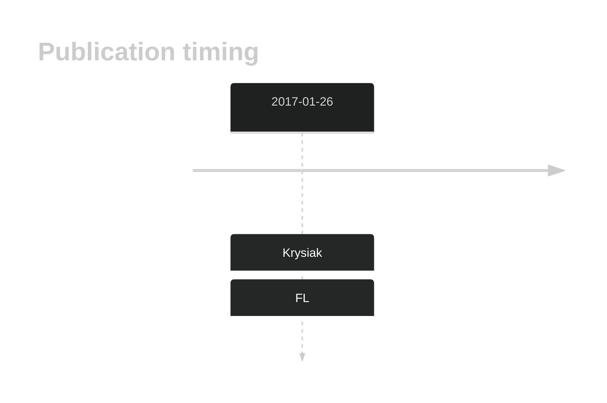

# HIST1H2BM

## History

## Relevance tier by entity

|Entity|Tier|Description                           |
|:------:|:----:|--------------------------------------|
|    |2   |relevance in FL not firmly established[@krysiakRecurrentSomaticMutations2017]|

## Mutation incidence in large patient cohorts (GAMBL reanalysis)

|Entity|source       |frequency (%)|
|:------:|:-------------:|:-------------:|
|FL    |GAMBL genomes|0.69         |

## Mutation pattern and selective pressure estimates

|Entity|aSHM|Significant selection|dN/dS (missense)|dN/dS (nonsense)|
|:------:|:----:|:---------------------:|:----------------:|:----------------:|
|BL    |No  |No                   |2.367           |54.179          |
|DLBCL |No  |No                   |1.312           | 0.000          |
|FL    |No  |No                   |1.980           | 0.000          |

View coding variants in ProteinPaint [hg19](https://morinlab.github.io/LLMPP/GAMBL/HIST1H2BM_protein.html)  or [hg38](https://morinlab.github.io/LLMPP/GAMBL/HIST1H2BM_protein_hg38.html)

View all variants in GenomePaint [hg19](https://morinlab.github.io/LLMPP/GAMBL/HIST1H2BM.html)  or [hg38](https://morinlab.github.io/LLMPP/GAMBL/HIST1H2BM_hg38.html)

## HIST1H2BM Expression

<!-- ORIGIN: krysiakRecurrentSomaticMutations2017b -->
<!-- FL: krysiakRecurrentSomaticMutations2017b -->

## References
