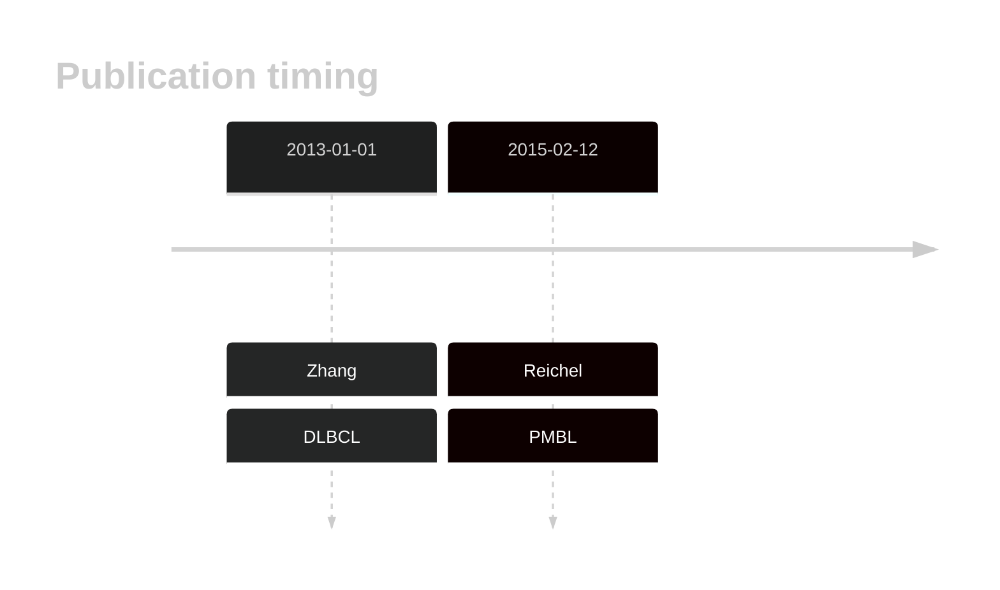
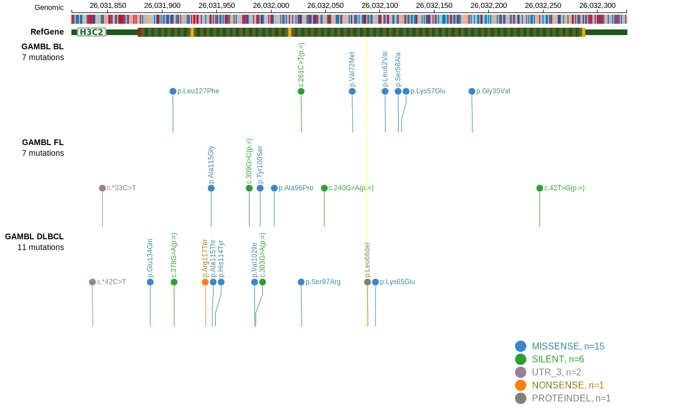

# HIST1H3B

## History

## Relevance tier by entity

|Entity|Tier|Description               |
|:------:|:----:|--------------------------|
||2|relevance in PMBL/cHL/GZL not firmly established|
| |1   |high-confidence DLBCL gene|
|    |1   |high-confidence FL gene   |

## Mutation incidence in large patient cohorts (GAMBL reanalysis)

|Entity|source        |frequency (%)|
|:------:|:--------------:|:-------------:|
|DLBCL |GAMBL genomes |2.10         |
|DLBCL |Schmitz cohort|1.70         |
|DLBCL |Reddy cohort  |2.00         |
|DLBCL |Chapuy cohort |2.14         |
|FL    |GAMBL genomes |1.62         |

## Mutation pattern and selective pressure estimates

|Entity|aSHM|Significant selection|dN/dS (missense)|dN/dS (nonsense)|
|:------:|:----:|:---------------------:|:----------------:|:----------------:|
|BL    |No  |No                   |8.244           |0.000           |
|DLBCL |No  |No                   |2.108           |9.678           |
|FL    |No  |No                   |1.637           |0.000           |

 ## HIST1H3B Hotspots

| Chromosome |Coordinate (hg19) | ref>alt | HGVSp | 
 | :---:| :---: | :--: | :---: |
|chr6|26032045|C>T|D82N| 
|chr6|26032029|C>G|S87T| 
|chr6|26032029|C>T|S87N| 
|chr6|26032028|G>C|S87R| 
|chr6|26032021|C>T|V90M| 
|chr6|26032017|A>G|M91T| 

View coding variants in ProteinPaint [hg19](https://morinlab.github.io/LLMPP/GAMBL/HIST1H3B_protein.html)  or [hg38](https://morinlab.github.io/LLMPP/GAMBL/HIST1H3B_protein_hg38.html)

View all variants in GenomePaint [hg19](https://morinlab.github.io/LLMPP/GAMBL/HIST1H3B.html)  or [hg38](https://morinlab.github.io/LLMPP/GAMBL/HIST1H3B_hg38.html)

## HIST1H3B Expression

<!-- ORIGIN: zhangGeneticHeterogeneityDiffuse2013 -->
<!-- DLBCL: zhangGeneticHeterogeneityDiffuse2013 -->
<!-- PMBL: reichelFlowSortingExome2015a -->

## References
1.  Zhang J, Grubor V, Love CL, Banerjee A, Richards KL, Mieczkowski PA, Dunphy C, Choi W, Au WY, Srivastava G, Lugar PL, Rizzieri DA, Lagoo AS, Bernal-Mizrachi L, Mann KP, Flowers C, Naresh K, Evens A, Gordon LI, Czader M, Gill JI, Hsi ED, Liu Q, Fan A, Walsh K, Jima D, Smith LL, Johnson AJ, Byrd JC, Luftig MA, Ni T, Zhu J, Chadburn A, Levy S, Dunson D, Dave SS. Genetic heterogeneity of diffuse large B-cell lymphoma. 2013 Jan; 
2.  Reichel J, Chadburn A, Rubinstein PG, Giulino-Roth L, Tam W, Liu Y, Gaiolla R, Eng K, Brody J, Inghirami G, Carlo-Stella C, Santoro A, Rahal D, Totonchy J, Elemento O, Cesarman E, Roshal M. Flow sorting and exome sequencing reveal the oncogenome of primary Hodgkin and Reed-Sternberg cells. Blood. 2015 Feb 12;125(7):1061–1072. PMID: 25488972
