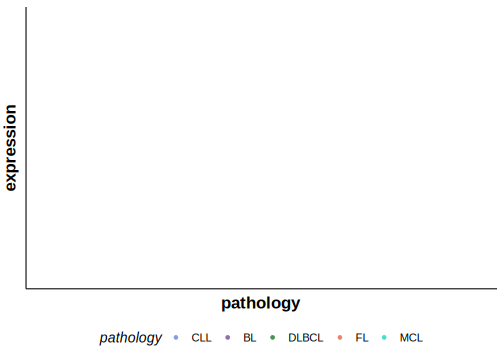

[[_TOC_]]

## Relevance tier by entity

|Entity|Tier|Description            |
|:------:|:----:|-----------------------|
|    |1   |high-confidence FL gene[@krysiakRecurrentSomaticMutations2017]|

## Mutation incidence in large patient cohorts (GAMBL reanalysis)

|Entity|source       |frequency (%)|
|:------:|:-------------:|:-------------:|
|FL    |GAMBL genomes|1.62         |

## Mutation pattern and selective pressure estimates

|Entity|aSHM|Significant selection|dN/dS (missense)|dN/dS (nonsense)|
|:------:|:----:|:---------------------:|:----------------:|:----------------:|
|BL    |No  |No                   |1.701           |0.000           |
|DLBCL |No  |No                   |0.517           |5.984           |
|FL    |No  |No                   |3.230           |0.000           |

[[include:browser_HIST1H3G.md]]

## Expression

<!-- ORIGIN: krysiakRecurrentSomaticMutations2017b -->
<!-- FL: krysiakRecurrentSomaticMutations2017b -->

[[include:mermaid_HIST1H3G.md]]

## References
