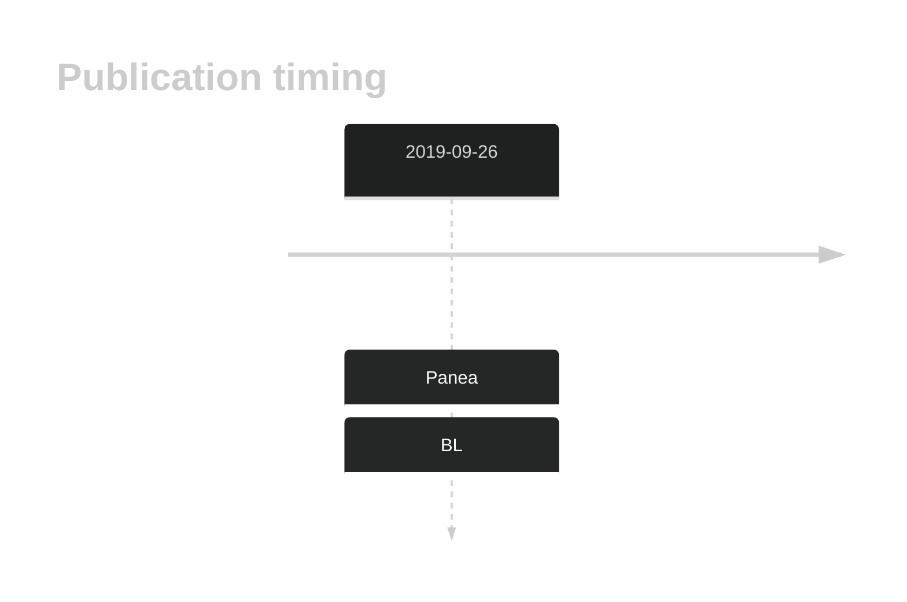
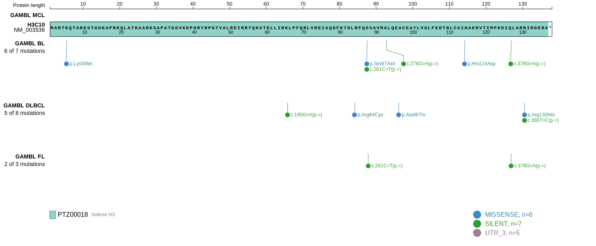
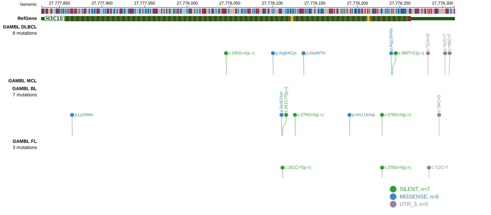
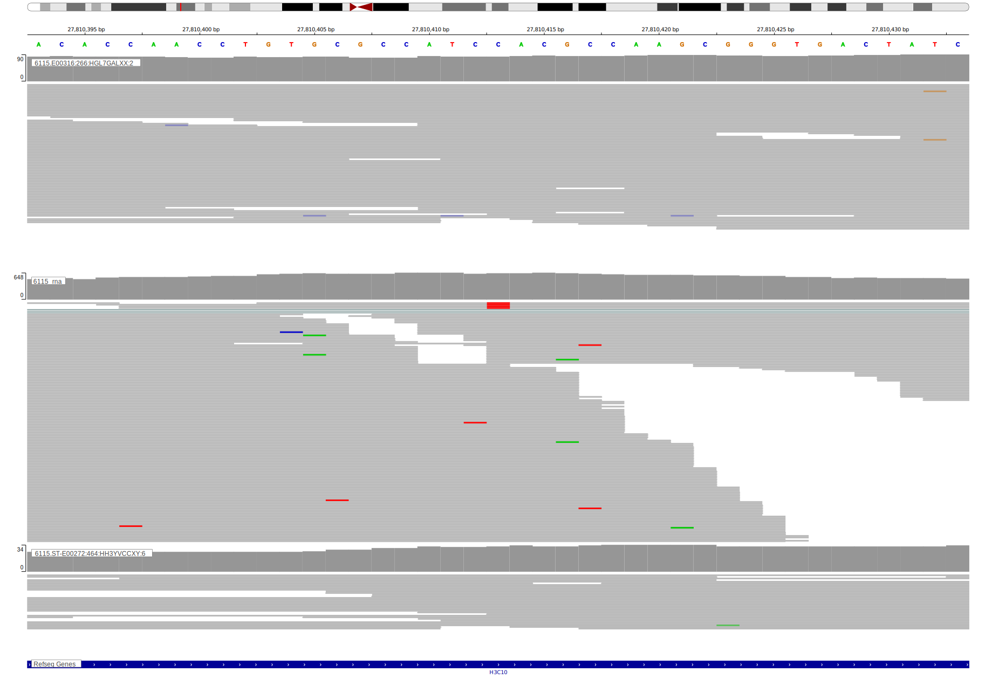

# HIST1H3H

<<Warn("The variants reported in this gene failed QC")>>

**[See below ](#representative-mutations) or [the study page ](papers/paneaWholeGenomeLandscape2019.md#tier-2) for more information**

## History

## Relevance tier by entity

|Entity|Tier|Description                           |
|:------:|:----:|--------------------------------------|
|    |2-F   |Failed QC|

## Mutation incidence in large patient cohorts (GAMBL reanalysis)

|Entity|source               |frequency (%)|
|:------:|:---------------------:|:-------------:|
|BL    |GAMBL genomes+capture|2.08         |
|BL    |Thomas cohort        |1.30         |
|BL    |Panea cohort         |5.90         |

## Mutation pattern and selective pressure estimates

|Entity|aSHM|Significant selection|dN/dS (missense)|dN/dS (nonsense)|
|:------:|:----:|:---------------------:|:----------------:|:----------------:|
|BL    |No  |No                   |1.791           |0               |
|DLBCL |No  |No                   |1.257           |0               |
|FL    |No  |No                   |0.000           |0               |

View coding variants in ProteinPaint [hg19](https://morinlab.github.io/LLMPP/GAMBL/HIST1H3H_protein.html)  or [hg38](https://morinlab.github.io/LLMPP/GAMBL/HIST1H3H_protein_hg38.html)

View all variants in GenomePaint [hg19](https://morinlab.github.io/LLMPP/GAMBL/HIST1H3H.html)  or [hg38](https://morinlab.github.io/LLMPP/GAMBL/HIST1H3H_hg38.html)

## Representative Mutations

### BL2

**Rating**
&star; &star; &star; &star; &star;

**Rating**
&star; &star; &star; &star; &star;

## References
