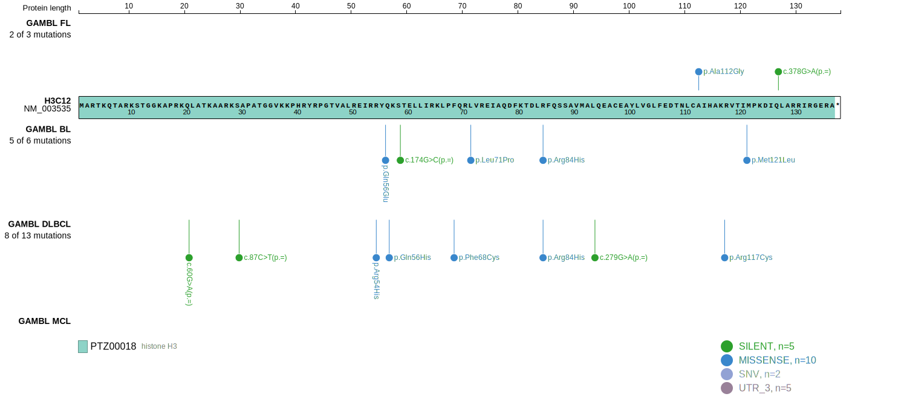
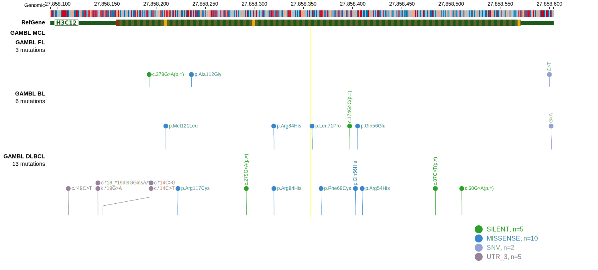

# HIST1H3J

## Relevance tier by entity

|Entity|Tier|Description                           |
|:------:|:----:|--------------------------------------|
|BL    |2   |relevance in BL not firmly established|

## Mutation incidence in large patient cohorts (GAMBL reanalysis)

|Entity|source               |frequency (%)|
|:------:|:---------------------:|:-------------:|
|BL    |GAMBL genomes+capture|2.31         |
|BL    |Thomas cohort        |1.70         |
|BL    |Panea cohort         |5.00         |

## Mutation pattern and selective pressure estimates

|Entity|aSHM|Significant selection|dN/dS (missense)|dN/dS (nonsense)|
|:------:|:----:|:---------------------:|:----------------:|:----------------:|
|BL    |No  |No                   |6.396           |0               |
|DLBCL |No  |No                   |1.417           |0               |
|FL    |No  |No                   |0.000           |0               |

> [!NOTE]
> First described in BL in 2019 by [Panea RI](https://pubmed.ncbi.nlm.nih.gov/31558468)

 ## HIST1H3J Hotspots

| Chromosome |Coordinate (hg19) | ref>alt | HGVSp | 
 | :---:| :---: | :--: | :---: |
| chr6 | 27858236 | G>C | A112G |
| chr6 | 27858222 | G>A | R117C |
| chr6 | 27858210 | T>G | M121L |

View coding variants in ProteinPaint [hg19](https://morinlab.github.io/LLMPP/GAMBL/HIST1H3J_protein.html)  or [hg38](https://morinlab.github.io/LLMPP/GAMBL/HIST1H3J_protein_hg38.html)

View all variants in GenomePaint [hg19](https://morinlab.github.io/LLMPP/GAMBL/HIST1H3J.html)  or [hg38](https://morinlab.github.io/LLMPP/GAMBL/HIST1H3J_hg38.html)

