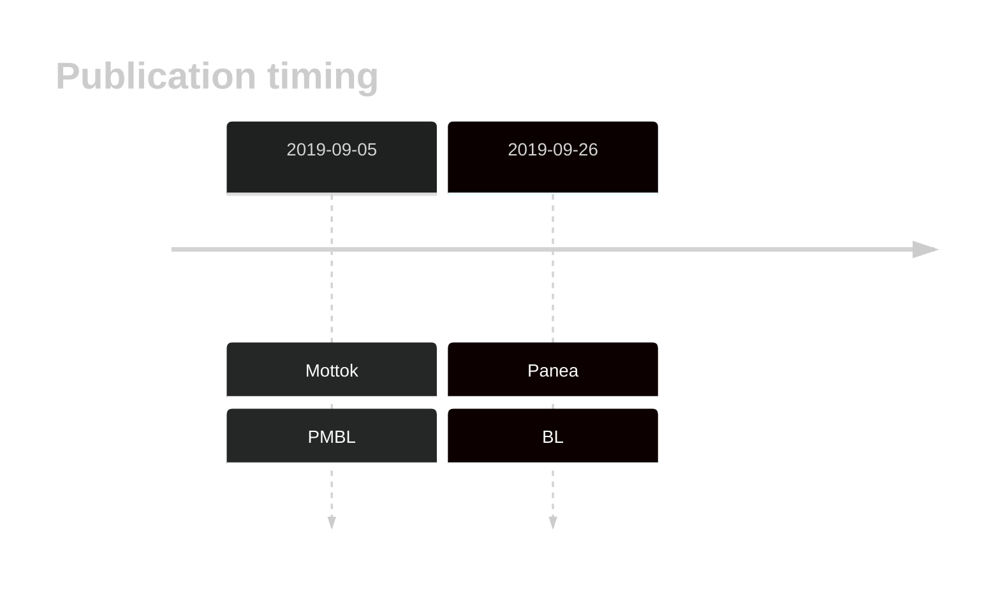
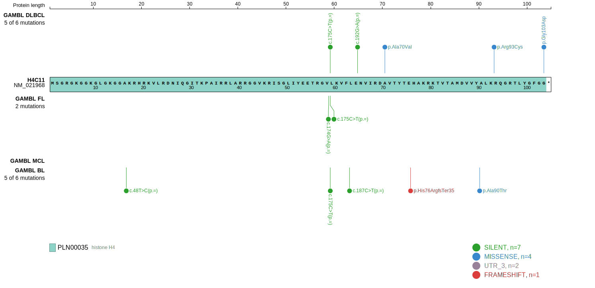
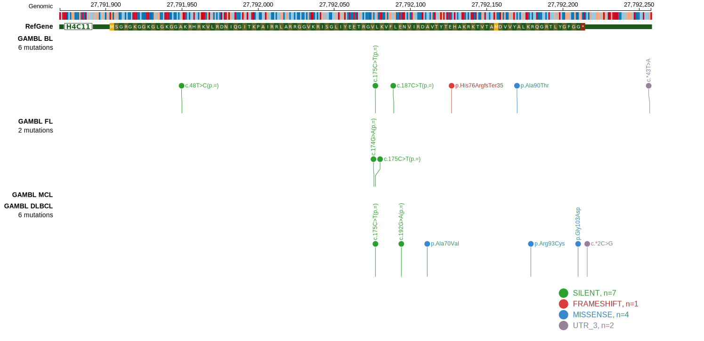

# HIST1H4J
## History

## Relevance tier by entity

|Entity|Tier|Description                           |
|:------:|:----:|--------------------------------------|
||2|relevance in PMBL/cHL/GZL not firmly established|
|    |2   |relevance in BL not firmly established|

## Mutation incidence in large patient cohorts (GAMBL reanalysis)

|Entity|source               |frequency (%)|
|:------:|:---------------------:|:-------------:|
|BL    |GAMBL genomes+capture|0.46         |
|BL    |Thomas cohort        |0.40         |
|BL    |Panea cohort         |  NA         |

## Mutation pattern and selective pressure estimates

|Entity|aSHM|Significant selection|dN/dS (missense)|dN/dS (nonsense)|
|:------:|:----:|:---------------------:|:----------------:|:----------------:|
|BL    |No  |No                   |0.955           |0               |
|DLBCL |No  |No                   |1.504           |0               |
|FL    |No  |No                   |0.000           |0               |

> [!NOTE]
> First described in BL in 2019 by [Panea RI](https://pubmed.ncbi.nlm.nih.gov/31558468)

View coding variants in ProteinPaint [hg19](https://morinlab.github.io/LLMPP/GAMBL/HIST1H4J_protein.html)  or [hg38](https://morinlab.github.io/LLMPP/GAMBL/HIST1H4J_protein_hg38.html)

View all variants in GenomePaint [hg19](https://morinlab.github.io/LLMPP/GAMBL/HIST1H4J.html)  or [hg38](https://morinlab.github.io/LLMPP/GAMBL/HIST1H4J_hg38.html)

## HIST1H4J Expression

## References
1.  Mottok A, Hung SS, Chavez EA, Woolcock B, Telenius A, Chong LC, Meissner B, Nakamura H, Rushton C, Viganò E, Sarkozy C, Gascoyne RD, Connors JM, Ben-Neriah S, Mungall A, Marra MA, Siebert R, Scott DW, Savage KJ, Steidl C. Integrative genomic analysis identifies key pathogenic mechanisms in primary mediastinal large B-cell lymphoma. Blood. 2019 Sep 5;134(10):802–813. PMID: 31292115
2.  Panea R, Love C, Shingleton JR, Reddy A, Bailey J, Moormann A, Otieno J, Ong’echa J, Oduor C, Schroêder K, Masalu N, Chao N, Agajanian M, Major M, Fedoriw Y, Richards K, Rymkiewicz G, Miles R, Alobeid B, Bhagat G, Flowers C, Ondrejka S, Hsi E, Choi W, Au-Yeung R, Hartmann W, Lenz G, Meyerson H, Lin YY, Zhuang Y, Luftig M, Waldrop A, Dave T, Thakkar D, Sahay H, Li G, Palus B, Seshadri V, Kim S, Gascoyne R, Levy S, Mukhopadhyay M, Dunson D, Dave S. The whole genome landscape of Burkitt lymphoma subtypes. Blood. 2019; 
<!-- PMBL: mottokIntegrativeGenomicAnalysis2019b -->
<!-- ORIGIN: paneaWholeGenomeLandscape2019 -->
<!-- BL: paneaWholeGenomeLandscape2019 -->
<!-- BL: paneaWholeGenomeLandscape2019 -->
