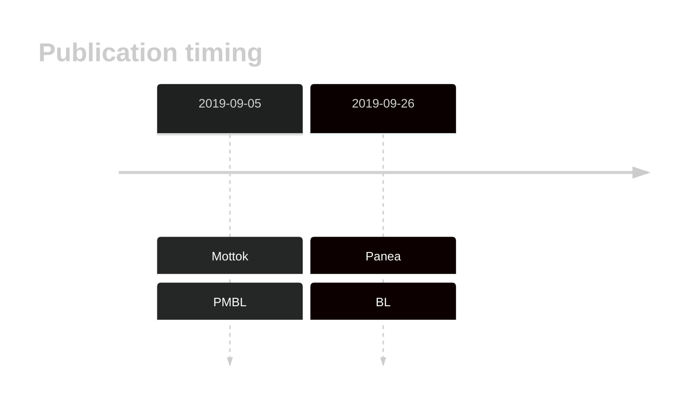
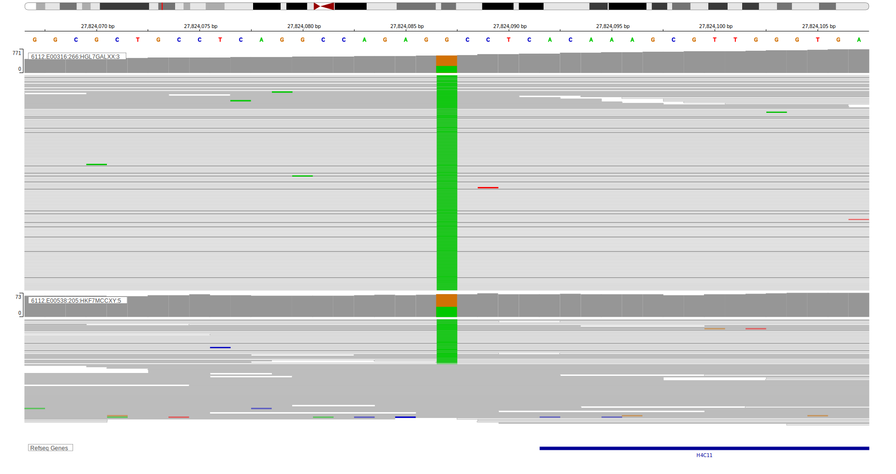

# HIST1H4J

## History

## Relevance tier by entity

|Entity|Tier|Description                           |
|:------:|:----:|--------------------------------------|
||2|relevance in PMBL/cHL/GZL not firmly established[@mottokIntegrativeGenomicAnalysis2019b]|
|    |2   |relevance in BL not firmly established[@paneaWholeGenomeLandscape2019]|

## Mutation incidence in large patient cohorts (GAMBL reanalysis)

|Entity|source               |frequency (%)|
|:------:|:---------------------:|:-------------:|
|BL    |GAMBL genomes+capture|0.46         |
|BL    |Thomas cohort        |0.40         |
|BL    |Panea cohort         |  NA         |

## Mutation pattern and selective pressure estimates

|Entity|aSHM|Significant selection|dN/dS (missense)|dN/dS (nonsense)|
|:------:|:----:|:---------------------:|:----------------:|:----------------:|
|BL    |No  |No                   |0.955           |0               |
|DLBCL |No  |No                   |1.504           |0               |
|FL    |No  |No                   |0.000           |0               |

View coding variants in ProteinPaint [hg19](https://morinlab.github.io/LLMPP/GAMBL/HIST1H4J_protein.html)  or [hg38](https://morinlab.github.io/LLMPP/GAMBL/HIST1H4J_protein_hg38.html)

View all variants in GenomePaint [hg19](https://morinlab.github.io/LLMPP/GAMBL/HIST1H4J.html)  or [hg38](https://morinlab.github.io/LLMPP/GAMBL/HIST1H4J_hg38.html)

## Representative Mutations

### BL2

**Rating**
&starf; &starf; &starf; &star; &star;

## References

<!-- PMBL: mottokIntegrativeGenomicAnalysis2019b -->
<!-- ORIGIN: paneaWholeGenomeLandscape2019 -->
<!-- BL: paneaWholeGenomeLandscape2019 -->
<!-- BL: paneaWholeGenomeLandscape2019 -->
