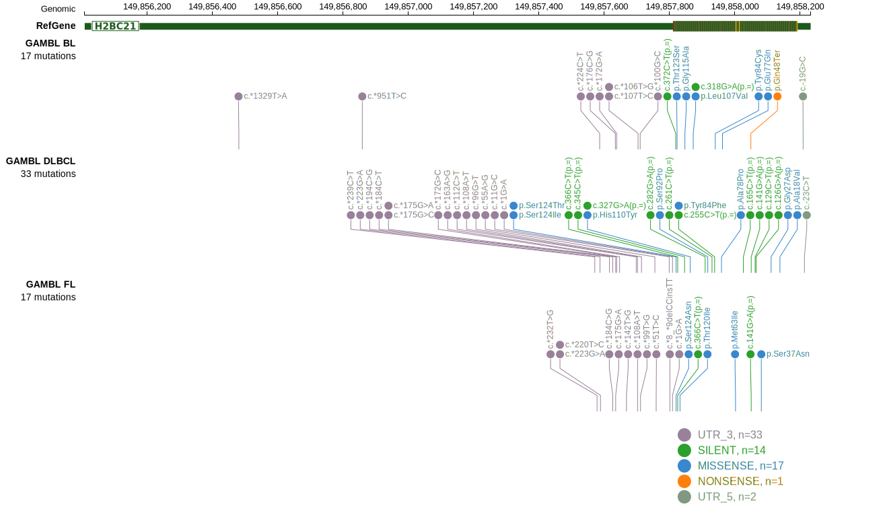

# HIST2H2BE

## Overview
This gene encodes the H2A protein, one of the core proteins comprising nucleosomes. Although relatively common in DLBCL, little is known about the function of these mutations. 

## History

## Relevance tier by entity

|Entity|Tier|Description               |
|:------:|:----:|--------------------------|
| |1   |high-confidence DLBCL gene|

## Mutation incidence in large patient cohorts (GAMBL reanalysis)

|Entity|source        |frequency (%)|
|:------:|:--------------:|:-------------:|
|DLBCL |GAMBL genomes |2.49         |
|DLBCL |Schmitz cohort|3.19         |
|DLBCL |Reddy cohort  |2.60         |
|DLBCL |Chapuy cohort |2.99         |

## Mutation pattern and selective pressure estimates

|Entity|aSHM|Significant selection|dN/dS (missense)|dN/dS (nonsense)|
|:------:|:----:|:---------------------:|:----------------:|:----------------:|
|BL    |No  |No                   |3.780           |40.980          |
|DLBCL |No  |No                   |0.601           | 3.291          |
|FL    |No  |No                   |3.156           | 0.000          |

View coding variants in ProteinPaint [hg19](https://morinlab.github.io/LLMPP/GAMBL/HIST2H2BE_protein.html)  or [hg38](https://morinlab.github.io/LLMPP/GAMBL/HIST2H2BE_protein_hg38.html)

View all variants in GenomePaint [hg19](https://morinlab.github.io/LLMPP/GAMBL/HIST2H2BE.html)  or [hg38](https://morinlab.github.io/LLMPP/GAMBL/HIST2H2BE_hg38.html)

## HIST2H2BE Expression

<!-- ORIGIN: schmitzGeneticsPathogenesisDiffuse2018a -->
<!-- DLBCL: schmitzGeneticsPathogenesisDiffuse2018a -->

## References
1.  Schmitz R, Wright GW, Huang DW, Johnson CA, Phelan JD, Wang JQ, Roulland S, Kasbekar M, Young RM, Shaffer AL, Hodson DJ, Xiao W, Yu X, Yang Y, Zhao H, Xu W, Liu X, Zhou B, Du W, Chan WC, Jaffe ES, Gascoyne RD, Connors JM, Campo E, Lopez-Guillermo A, Rosenwald A, Ott G, Delabie J, Rimsza LM, Tay Kuang Wei K, Zelenetz AD, Leonard JP, Bartlett NL, Tran B, Shetty J, Zhao Y, Soppet DR, Pittaluga S, Wilson WH, Staudt LM. Genetics and Pathogenesis of Diffuse Large B-Cell Lymphoma. N Engl J Med. 2018 Apr 12;378(15):1396–1407. PMCID: PMC6010183
