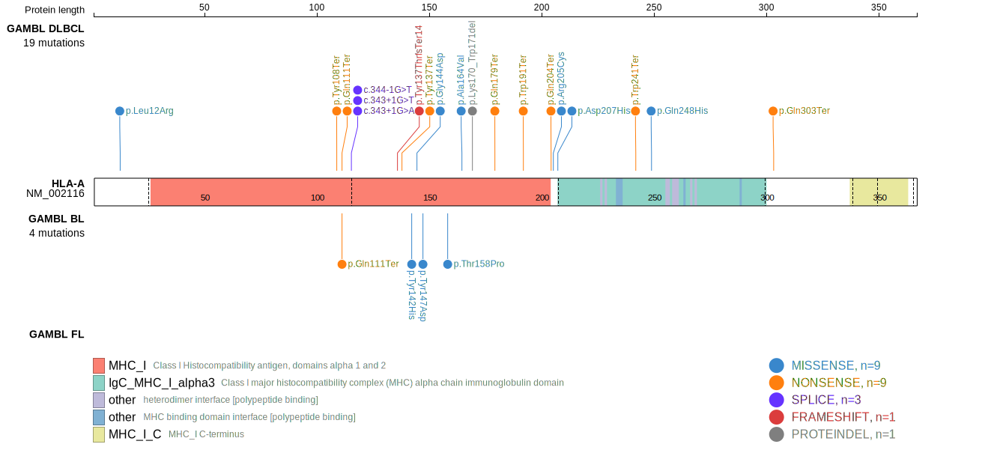
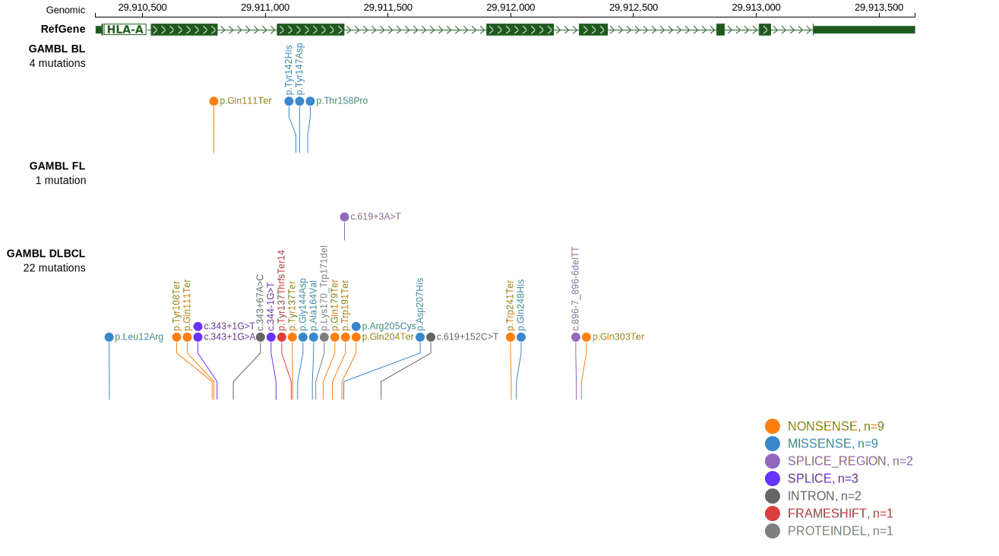

# HLA-A

## Relevance tier by entity

|Entity|Tier|Description                           |
|:------:|:----:|--------------------------------------|
|BL    |2   |relevance in BL not firmly established|
|DLBCL |1   |high-confidence DLBCL gene            |

## Mutation incidence in large patient cohorts (GAMBL reanalysis)

|Entity|source               |frequency (%)|
|:------:|:---------------------:|:-------------:|
|BL    |GAMBL genomes+capture| 1.39        |
|BL    |Thomas cohort        | 1.30        |
|BL    |Panea cohort         |   NA        |
|DLBCL |GAMBL genomes        | 7.46        |
|DLBCL |Schmitz cohort       |11.06        |
|DLBCL |Reddy cohort         | 0.20        |
|DLBCL |Chapuy cohort        | 8.97        |

## Mutation pattern and selective pressure estimates

|Entity|aSHM|Significant selection|dN/dS (missense)|dN/dS (nonsense)|
|:------:|:----:|:---------------------:|:----------------:|:----------------:|
|BL    |No  |No                   | 4.995          | 22.371         |
|DLBCL |No  |Yes                  |14.841          |190.534         |
|FL    |No  |No                   | 0.000          |  0.000         |

 ## HLA-A Hotspots

| Chromosome |Coordinate (hg19) | ref>alt | HGVSp | 
 | :---:| :---: | :--: | :---: |
| chr6 | 29910596 | T>A | F46I |
| chr6 | 29910609 | G>A | G50D |

View coding variants in ProteinPaint [hg19](https://morinlab.github.io/LLMPP/GAMBL/HLA-A_protein.html)  or [hg38](https://morinlab.github.io/LLMPP/GAMBL/HLA-A_protein_hg38.html)

View all variants in GenomePaint [hg19](https://morinlab.github.io/LLMPP/GAMBL/HLA-A.html)  or [hg38](https://morinlab.github.io/LLMPP/GAMBL/HLA-A_hg38.html)

