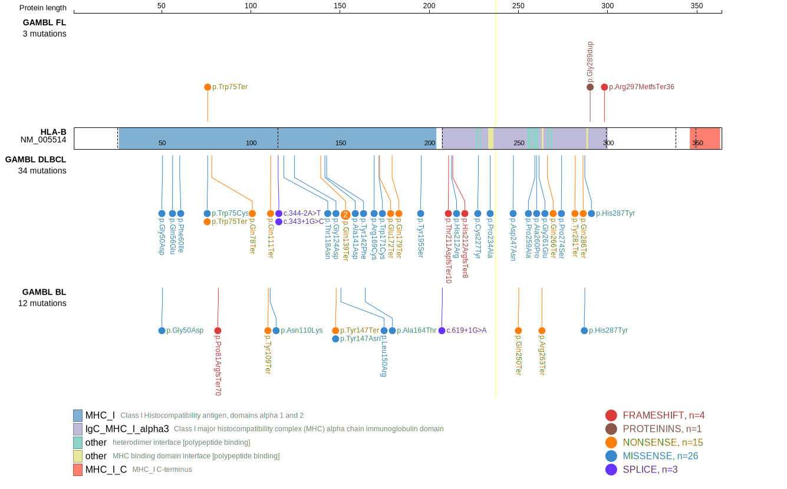

# [HLA-B]

## Mutation tier

|Entity|Tier|Description                           |
|:------:|:----:|--------------------------------------|
|BL    |2   |relevance in BL not firmly established|
|DLBCL |1   |high-confidence DLBCL gene            |
|FL    |2   |relevance in FL not firmly established|
## Mutation incidence

|Entity|source               |frequency (%)|
|:------:|:---------------------:|:-------------:|
|BL    |GAMBL genomes+capture| 3.46        |
|BL    |Thomas cohort        | 3.80        |
|BL    |Panea cohort         | 5.00        |
|DLBCL |GAMBL genomes        | 9.18        |
|DLBCL |Schmitz cohort       |16.40        |
|DLBCL |Reddy cohort         | 1.20        |
|DLBCL |Chapuy cohort        |10.70        |
|FL    |GAMBL genomes        | 3.46        |

## Mutation pattern

|Entity|aSHM|Significant selection|dN/dS (missense)|dN/dS (nonsense)|
|:------:|:----:|:---------------------:|:----------------:|:----------------:|
|BL    |No  |Yes                  | 6.598          | 94.947         |
|DLBCL |No  |Yes                  |27.361          |222.398         |
|FL    |No  |No                   | 0.000          | 88.288         |

View coding variants in ProteinPaint [hg19](https://www.bcgsc.ca/downloads/morinlab/GAMBL/test/genes/HLA-B_protein.html)  or [hg38](https://www.bcgsc.ca/downloads/morinlab/GAMBL/test/genes/HLA-B_protein_hg38.html)

View all variants in GenomePaint [hg19](https://www.bcgsc.ca/downloads/morinlab/GAMBL/test/genes/HLA-B.html)

