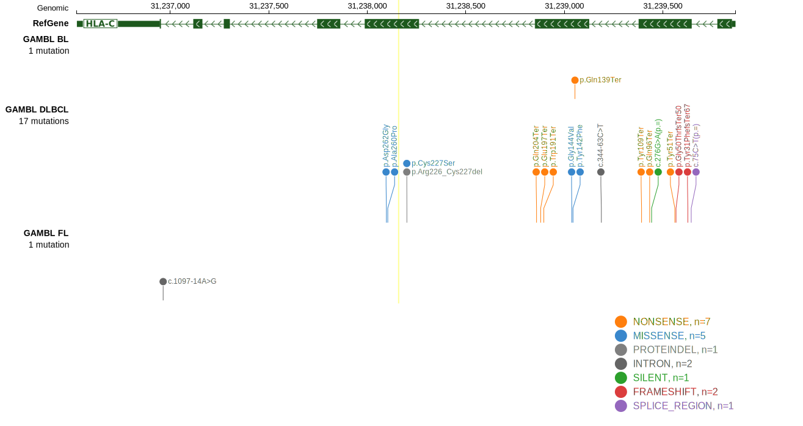

# HLA-C

## Overview
Mutations in the HLA-C gene have been associated with a loss of cell surface expression of HLA class I molecules, which are essential for presenting tumor antigens to cytotoxic T cells. This is a common mechanism of immune escape in DLBCL. Deletions of this gene are more commonly reported than HLA-C mutations.1 The mutation pattern in DLBCL implies the preferential accumulation of *inactivating mutations*. Different analytical strategies relating to the mapping of sequencing data and subtracting common germline variants can complicate the detection of mutations in this and other HLA genes. Likely owing to this, the rate of mutations is highly variable across studies and the true mutation rate has not been firmly established. 

## History

## Relevance tier by entity

|Entity|Tier|Description               |
|:------:|:----:|--------------------------|
||2|relevance in PMBL/cHL/GZL not firmly established|
| |1   |high-confidence DLBCL gene|

## Mutation incidence in large patient cohorts (GAMBL reanalysis)

|Entity|source        |frequency (%)|
|:------:|:--------------:|:-------------:|
|DLBCL |GAMBL genomes |3.63         |
|DLBCL |Schmitz cohort|5.53         |
|DLBCL |Reddy cohort  |  NA         |
|DLBCL |Chapuy cohort |4.70         |

## Mutation pattern and selective pressure estimates

|Entity|aSHM|Significant selection|dN/dS (missense)|dN/dS (nonsense)|
|:------:|:----:|:---------------------:|:----------------:|:----------------:|
|BL    |No  |No                   |1.687           | 0.000          |
|DLBCL |No  |Yes                  |6.500           |33.396          |
|FL    |No  |No                   |0.000           | 0.000          |

View coding variants in ProteinPaint [hg19](https://morinlab.github.io/LLMPP/GAMBL/HLA-C_protein.html)  or [hg38](https://morinlab.github.io/LLMPP/GAMBL/HLA-C_protein_hg38.html)

View all variants in GenomePaint [hg19](https://morinlab.github.io/LLMPP/GAMBL/HLA-C.html)  or [hg38](https://morinlab.github.io/LLMPP/GAMBL/HLA-C_hg38.html)

## HLA-C Expression

<!-- ORIGIN: gomezUltraDeepSequencingReveals2023 -->
<!-- PMBL: gomezUltraDeepSequencingReveals2023 -->

## References
1.  Gomez F, Fisk B, McMichael JF, Mosior M, Foltz JA, Skidmore ZL, Duncavage EJ, Miller CA, Abel H, Li YS, Russler-Germain DA, Krysiak K, Watkins MP, Ramirez CA, Schmidt A, Martins Rodrigues F, Trani L, Khanna A, Wagner JA, Fulton RS, Fronick CC, O’Laughlin MD, Schappe T, Cashen AF, Mehta-Shah N, Kahl BS, Walker J, Bartlett NL, Griffith M, Fehniger TA, Griffith OL. Ultra-Deep Sequencing Reveals the Mutational Landscape of Classical Hodgkin Lymphoma. Cancer Res Commun. 2023 Nov 15;3(11):2312–2330. PMCID: PMC10648575
