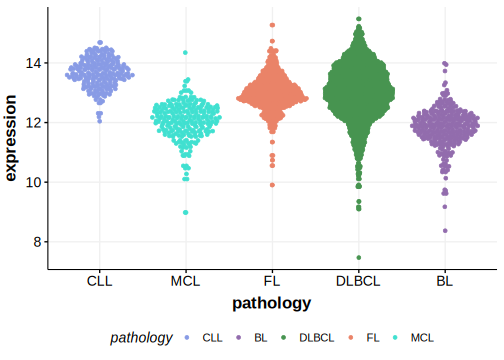

# HLA-DMA

## Overview
Mutations in this gene are relatively rare in DLBCL overall. 

## Relevance tier by entity

[[include:tables/table1_HLA-DMA.md]]

## Mutation incidence in large patient cohorts (GAMBL reanalysis)

|Entity|source        |frequency (%)|
|:------:|:--------------:|:-------------:|
|DLBCL |GAMBL genomes |0.38         |
|DLBCL |Schmitz cohort|1.28         |
|DLBCL |Reddy cohort  |  NA         |
|DLBCL |Chapuy cohort |1.71         |

## Mutation pattern and selective pressure estimates

[[include:tables/dnds_HLA-DMA.md]]

[[include:tables/browser_HLA-DMA.md]]

## Expression

<!-- FLAGGED FOR TIER 2 -->

<!-- ORIGIN: Unknown -->

## References
