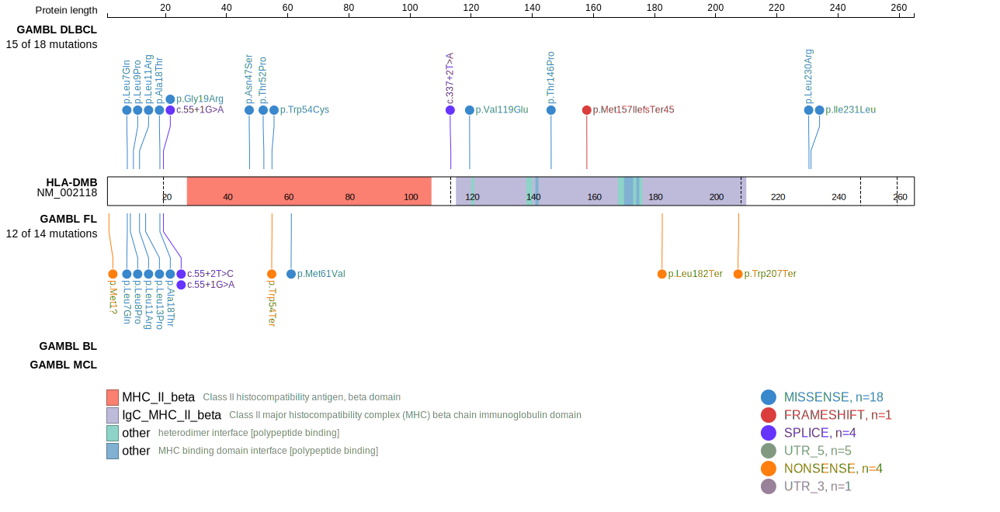
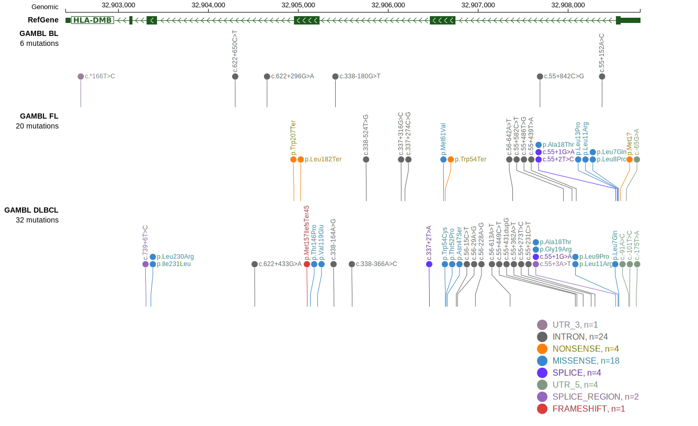
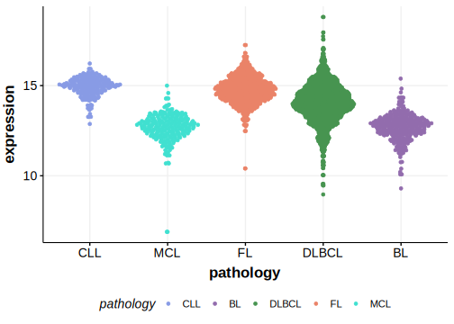

# HLA-DMB

## Overview
HLA-DMB, along with HLA-DMA, plays a critical role in the proper functioning of HLA class II molecules. These genes are essential for the loading of antigenic peptides onto HLA class II molecules, facilitating the presentation of these peptides to CD4+ T cells.

## Relevance tier by entity

|Entity|Tier|Description                           |
|:------:|:----:|--------------------------------------|
| |1   |high-confidence DLBCL gene            |

## Mutation incidence in large patient cohorts (GAMBL reanalysis)

[[include:DLBCL_HLA-DMB.md]]

## Mutation pattern and selective pressure estimates

|Entity|aSHM|Significant selection|dN/dS (missense)|dN/dS (nonsense)|
|:------:|:----:|:---------------------:|:----------------:|:----------------:|
|BL    |No  |No                   | 0.000          |  0.000         |
|DLBCL |No  |Yes                  |16.721          | 26.750         |
|FL    |No  |Yes                  |39.781          |282.532         |

View coding variants in ProteinPaint [hg19](https://morinlab.github.io/LLMPP/GAMBL/HLA-DMB_protein.html)  or [hg38](https://morinlab.github.io/LLMPP/GAMBL/HLA-DMB_protein_hg38.html)

View all variants in GenomePaint [hg19](https://morinlab.github.io/LLMPP/GAMBL/HLA-DMB.html)  or [hg38](https://morinlab.github.io/LLMPP/GAMBL/HLA-DMB_hg38.html)

## HLA-DMB Expression

<!-- ORIGIN: Unknown -->

## References
