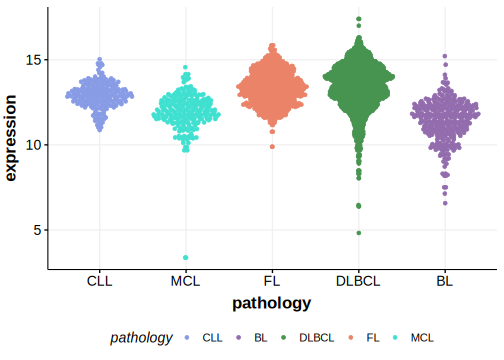

[[_TOC_]]

Mutations in this gene were first described in DLBCL and FL in 2021 by Hübschmann et al.1

## Relevance tier by entity

|Entity|Tier|Description               |
|:------:|:----:|--------------------------|
| |1   |high-confidence DLBCL gene[@hubschmannMutationalMechanismsShaping2021]|

## Mutation incidence in large patient cohorts (GAMBL reanalysis)

|Entity|source        |frequency (%)|
|:------:|:--------------:|:-------------:|
|DLBCL |GAMBL genomes |0.38         |
|DLBCL |Schmitz cohort|0.64         |
|DLBCL |Reddy cohort  |0.30         |
|DLBCL |Chapuy cohort |1.28         |

## Mutation pattern and selective pressure estimates

|Entity|aSHM|Significant selection|dN/dS (missense)|dN/dS (nonsense)|
|:------:|:----:|:---------------------:|:----------------:|:----------------:|
|BL    |No  |No                   |0               |0               |
|DLBCL |No  |No                   |0               |0               |
|FL    |No  |No                   |0               |0               |

## HLA-DQA1 Expression

## All Mutations

[SP116606](https://www.bcgsc.ca/downloads/morinlab/GAMBL/MALY/SP116606.html)
[SP124957](https://www.bcgsc.ca/downloads/morinlab/GAMBL/MALY/SP124957.html)
[SP192807](https://www.bcgsc.ca/downloads/morinlab/GAMBL/MALY/SP192807.html)
[SP193072](https://www.bcgsc.ca/downloads/morinlab/GAMBL/MALY/SP193072.html)
[SP193150](https://www.bcgsc.ca/downloads/morinlab/GAMBL/MALY/SP193150.html)
[SP59424](https://www.bcgsc.ca/downloads/morinlab/GAMBL/MALY/SP59424.html)

[[include:mermaid_HLA-DQA1.md]]

## References

<!-- FLAGGED FOR TIER 2 -->
<!-- ORPHANED -->
<!-- ORIGIN: hubschmannMutationalMechanismsShaping2021b -->
<!-- DLBCL: hubschmannMutationalMechanismsShaping2021b -->
