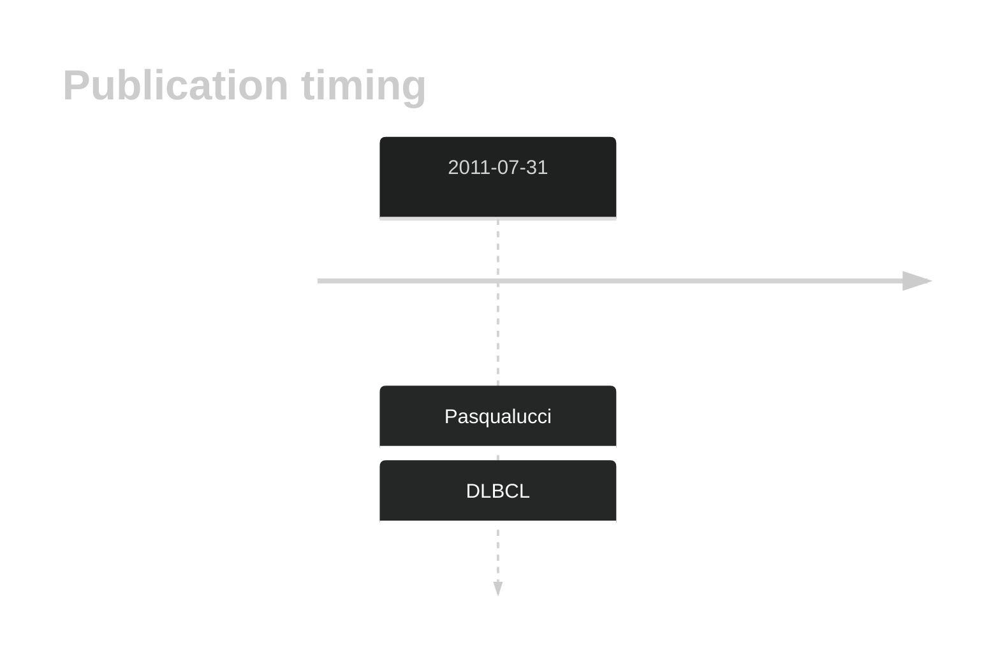
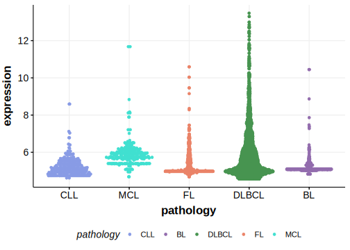

# HNF1B
## History

## Relevance tier by entity

|Entity|Tier|Description                              |
|:------:|:----:|-----------------------------------------|
| |2   |relevance in DLBCL not firmly established|

## Mutation incidence in large patient cohorts (GAMBL reanalysis)

|Entity|source        |frequency (%)|
|:------:|:--------------:|:-------------:|
|DLBCL |GAMBL genomes |0.19         |
|DLBCL |Schmitz cohort|2.55         |
|DLBCL |Reddy cohort  |0.30         |
|DLBCL |Chapuy cohort |0.85         |

## Mutation pattern and selective pressure estimates

|Entity|aSHM|Significant selection|dN/dS (missense)|dN/dS (nonsense)|
|:------:|:----:|:---------------------:|:----------------:|:----------------:|
|BL    |No  |No                   |0.000           |0               |
|DLBCL |No  |No                   |0.000           |0               |
|FL    |No  |No                   |2.652           |0               |

> [!NOTE]
> First described in DLBCL in 2011 by [Pasqualucci L](https://pubmed.ncbi.nlm.nih.gov/21804550)

View coding variants in ProteinPaint [hg19](https://morinlab.github.io/LLMPP/GAMBL/HNF1B_protein.html)  or [hg38](https://morinlab.github.io/LLMPP/GAMBL/HNF1B_protein_hg38.html)

View all variants in GenomePaint [hg19](https://morinlab.github.io/LLMPP/GAMBL/HNF1B.html)  or [hg38](https://morinlab.github.io/LLMPP/GAMBL/HNF1B_hg38.html)

## HNF1B Expression

<!-- ORIGIN: pasqualucciAnalysisCodingGenome2011 -->
<!-- DLBCL: pasqualucciAnalysisCodingGenome2011 -->
## References
1.  Pasqualucci L, Trifonov V, Fabbri G, Ma J, Rossi D, Chiarenza A, Wells VA, Grunn A, Messina M, Elliot O, Chan J, Bhagat G, Chadburn A, Gaidano G, Mullighan CG, Rabadan R, Dalla-Favera R. Analysis of the coding genome of diffuse large B-cell lymphoma. Nat Genet. 2011 Jul 31;43(9):830–837. PMCID: PMC3297422
