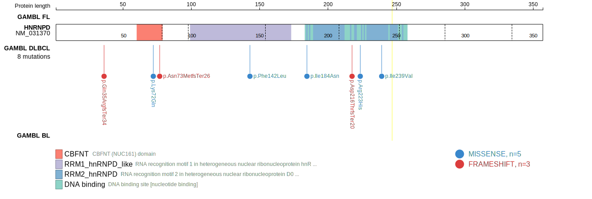
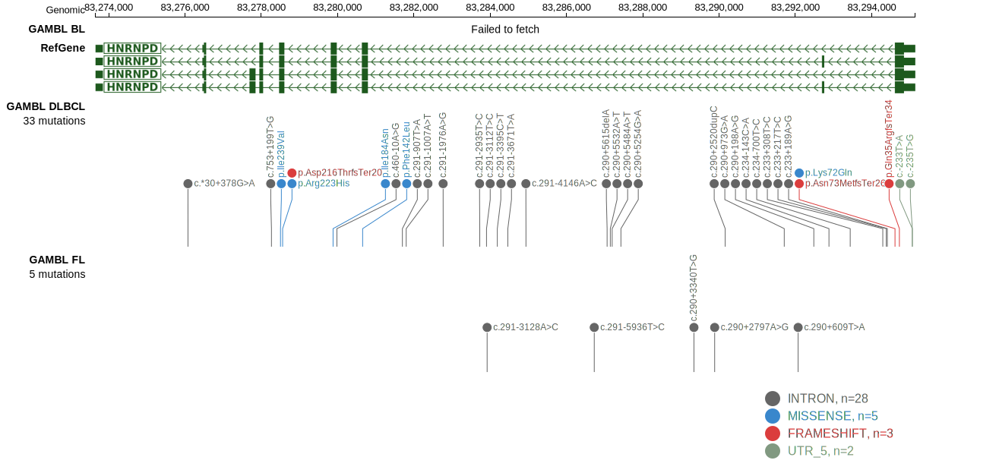

# [HNRNPD]

## Mutation tier

|Entity|Tier|Description                           |
|:------:|:----:|--------------------------------------|
|DLBCL |1   |high-confidence DLBCL gene            |
|FL    |2   |relevance in FL not firmly established|
## Mutation incidence

|Entity|source        |frequency (%)|
|:------:|:--------------:|:-------------:|
|DLBCL |GAMBL genomes |2.10         |
|DLBCL |Schmitz cohort|2.13         |
|DLBCL |Reddy cohort  |1.80         |
|DLBCL |Chapuy cohort |0.85         |
|FL    |GAMBL genomes |  NA         |

## Mutation pattern

|Entity|aSHM|Significant selection|dN/dS (missense)|dN/dS (nonsense)|
|:------:|:----:|:---------------------:|:----------------:|:----------------:|
|BL    |No  |No                   |0.000           |19.81           |
|DLBCL |No  |No                   |1.554           | 0.00           |
|FL    |No  |No                   |0.000           | 0.00           |

View coding variants in ProteinPaint [hg19](https://www.bcgsc.ca/downloads/morinlab/GAMBL/test/genes/HNRNPD_protein.html)  or [hg38](https://www.bcgsc.ca/downloads/morinlab/GAMBL/test/genes/HNRNPD_protein_hg38.html)

View all variants in GenomePaint [hg19](https://www.bcgsc.ca/downloads/morinlab/GAMBL/test/genes/HNRNPD.html)  or [hg38](https://www.bcgsc.ca/downloads/morinlab/GAMBL/test/genes/HNRNPD_hg38.html)

