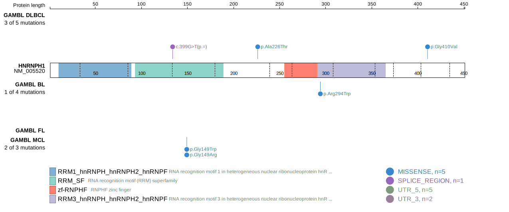
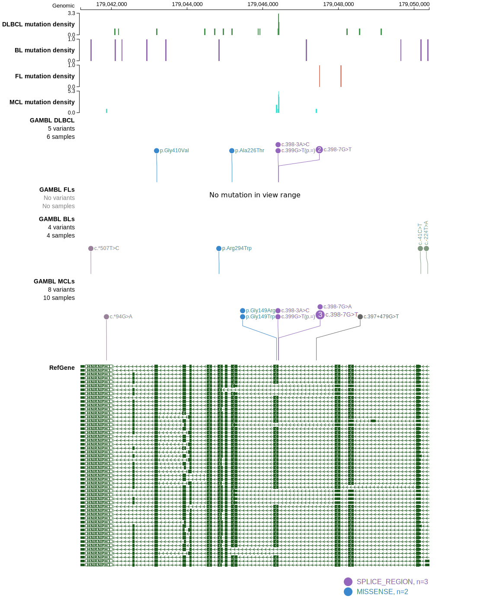

# [HNRNPH1]

## Mutation tier

|Entity|Tier|Description               |
|:------:|:----:|--------------------------|
|DLBCL |1   |high-confidence DLBCL gene|
|MCL   |1   |high-confidence MCL gene  |
## Mutation incidence

|Entity|source        |frequency (%)|
|:------:|:--------------:|:-------------:|
|DLBCL |GAMBL genomes |2.10         |
|DLBCL |Schmitz cohort|3.19         |
|DLBCL |Reddy cohort  |1.40         |
|DLBCL |Chapuy cohort |3.42         |
|MCL   |GAMBL genomes |3.79         |

## Mutation pattern

|Entity|aSHM|Significant selection|dN/dS (missense)|dN/dS (nonsense)|
|:------:|:----:|:---------------------:|:----------------:|:----------------:|
|BL    |No  |No                   |1.573           | 0.000          |
|DLBCL |No  |No                   |2.337           |10.139          |
|FL    |No  |No                   |0.000           | 0.000          |

> [!NOTE]
> First described in MCL in 2020 by [Pararajalingam P](https://pubmed.ncbi.nlm.nih.gov/32160292)

 ## HNRNPH1 Hotspots

| Chromosome |Coordinate (hg19) | ref>alt | HGVSp | 
 | :---:| :---: | :--: | :---: |
| chr5 | 179046407 | C>A | G133= |

View coding variants in ProteinPaint [hg19](https://www.bcgsc.ca/downloads/morinlab/GAMBL/test/genes/HNRNPH1_protein.html)  or [hg38](https://www.bcgsc.ca/downloads/morinlab/GAMBL/test/genes/HNRNPH1_protein_hg38.html)

View all variants in GenomePaint [hg19](https://www.bcgsc.ca/downloads/morinlab/GAMBL/test/genes/HNRNPH1.html)  or [hg38](https://www.bcgsc.ca/downloads/morinlab/GAMBL/test/genes/HNRNPH1_hg38.html)

