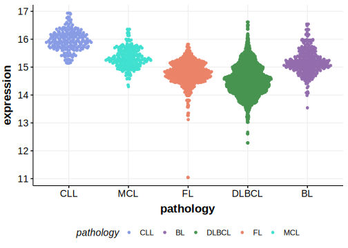

[[_TOC_]]

## Overview
Non-coding mutations, including synonymous and intronic mutations,  are enriched at splicing signals in exon 4 of HNRNPH1. 

## Experimental Evidence
The common HNRNPH1 mutations cause deregulated splicing and increased expression of the hnRNP H1 protein. This overexpression is linked to enhanced cell proliferation and survival, contributing to the aggressive nature of MCL.[@pararajalingamCodingNoncodingDrivers2020]  Although initially characterized in MCL, the same pattern of mutations appears in a small number of DLBCLs.

## Relevance tier by entity

[[include:table1_HNRNPH1.md]]

## Mutation incidence in large patient cohorts (GAMBL reanalysis)

|Entity|source        |frequency (%)|
|:------:|:--------------:|:-------------:|
|DLBCL |GAMBL genomes |2.10         |
|DLBCL |Schmitz cohort|3.19         |
|DLBCL |Reddy cohort  |1.40         |
|DLBCL |Chapuy cohort |3.42         |
|MCL   |GAMBL genomes |3.79         |

## Mutation pattern and selective pressure estimates

[[include:tables/dnds_HNRNPH1.md]]

## HNRNPH1 Hotspots

| Chromosome |Coordinate (hg19) | ref>alt | HGVSp | 
 | :---:| :---: | :--: | :---: |
| chr5 | 179046407 | C>A | G133= |

[[include:browser_HNRNPH1.md]]

## Expression

[[include:tables/mermaid_HNRNPH1.md]]

## References

<!-- NONCODING -->
<!-- ORIGIN: pararajalingamCodingNoncodingDrivers2020 -->
<!-- MCL: pararajalingamCodingNoncodingDrivers2020 -->
<!-- DLBCL: pararajalingamCodingNoncodingDrivers2020 -->
