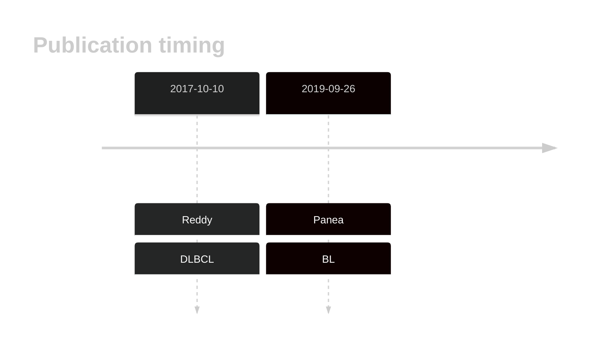
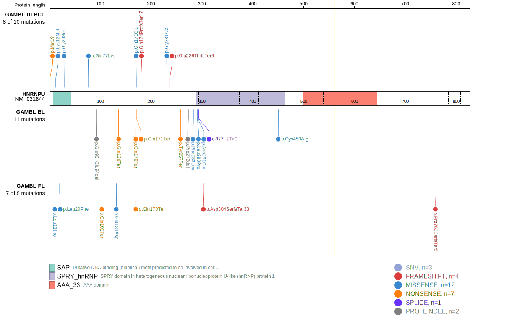
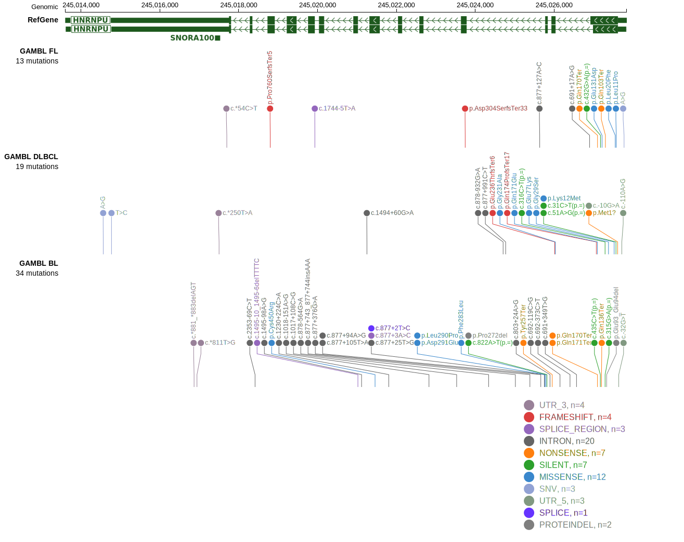

# HNRNPU

## History

## Relevance tier by entity

|Entity|Tier|Description               |
|:------:|:----:|--------------------------|
|    |1-a | aSHM target and high-confidence BL gene[@paneaWholeGenomeLandscape2019]   |
| |1-a | aSHM target and high-confidence DLBCL gene[@reddyGeneticFunctionalDrivers2017]|

## Mutation incidence

[[include:DLBCL_HNRNPU.md]]
[[include:BL_HNRNPU.md]]

## Mutation pattern

|Entity|aSHM|Significant selection|dN/dS (missense)|dN/dS (nonsense)|
|:------:|:----:|:---------------------:|:----------------:|:----------------:|
|BL    |Yes |Yes                  |1.081           |27.052          |
|DLBCL |Yes |No                   |1.712           | 0.000          |
|FL    |Yes |No                   |4.865           |31.056          |

## aSHM regions

|chr_name|hg19_start|hg19_end |region                                                                                     |regulatory_comment|
|:--------:|:----------:|:---------:|:-------------------------------------------------------------------------------------------:|:------------------:|
|chr1    |245023502 |245029083|[TSS](https://genome.ucsc.edu/s/rdmorin/GAMBL%20hg19?position=chr1%3A245023502%2D245029083)|NA                |

View coding variants in ProteinPaint [hg19](https://www.bcgsc.ca/downloads/morinlab/GAMBL/test/genes/HNRNPU_protein.html)  or [hg38](https://www.bcgsc.ca/downloads/morinlab/GAMBL/test/genes/HNRNPU_protein_hg38.html)

View all variants in GenomePaint [hg19](https://www.bcgsc.ca/downloads/morinlab/GAMBL/test/genes/HNRNPU.html)  or [hg38](https://www.bcgsc.ca/downloads/morinlab/GAMBL/test/genes/HNRNPU_hg38.html)

## References

<!-- ORIGIN: reddyGeneticFunctionalDrivers2017 -->
<!-- DLBCL: reddyGeneticFunctionalDrivers2017 -->
<!-- BL: paneaWholeGenomeLandscape2019 -->
