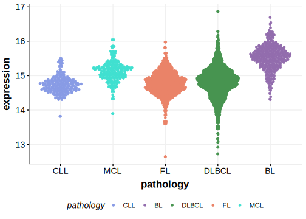

# HNRNPU
## Overview
HNRNPU is one of [a number of genes](https://github.com/morinlab/LLMPP/wiki/ashm) affected by aberrant somatic hypermutation in B-cell lymphomas, which complicates the interpretation of mutations at this locus. Mutations in HNRNPU are haploinsufficient and significantly alter the transcriptome of MYC-driven lymphomas. These mutations were found in a notable percentage of high-grade B-cell lymphomas with double-hit BCL2 translocations (HGBL-DH-BCL2) and Burkitt lymphoma (BL).1

## Relevance tier by entity

|Entity|Tier|Description               |
|:------:|:----:|--------------------------|
|BL    |1-a | aSHM target and high-confidence BL gene   |
|DLBCL |1-a | aSHM target and high-confidence DLBCL gene|

## Mutation incidence in large patient cohorts (GAMBL reanalysis)

|Entity|source               |frequency (%)|
|:------:|:---------------------:|:-------------:|
|BL    |GAMBL genomes+capture|5.77         |
|BL    |Thomas cohort        |6.40         |
|BL    |Panea cohort         |8.90         |
|DLBCL |GAMBL genomes        |2.49         |
|DLBCL |Schmitz cohort       |3.40         |
|DLBCL |Reddy cohort         |2.40         |
|DLBCL |Chapuy cohort        |3.42         |

## Mutation pattern and selective pressure estimates

|Entity|aSHM|Significant selection|dN/dS (missense)|dN/dS (nonsense)|
|:------:|:----:|:---------------------:|:----------------:|:----------------:|
|BL    |Yes |Yes                  |1.081           |27.052          |
|DLBCL |Yes |No                   |1.712           | 0.000          |
|FL    |Yes |No                   |4.865           |31.056          |

## aSHM regions

|chr_name|hg19_start|hg19_end |region                                                                                     |regulatory_comment|
|:--------:|:----------:|:---------:|:-------------------------------------------------------------------------------------------:|:------------------:|
|chr1    |245023502 |245029083|[TSS](https://genome.ucsc.edu/s/rdmorin/GAMBL%20hg19?position=chr1%3A245023502%2D245029083)|NA                |

> [!NOTE]
> First described in BL in 2019 by [Panea RI](https://pubmed.ncbi.nlm.nih.gov/31558468)

 ## HNRNPU Hotspots

| Chromosome |Coordinate (hg19) | ref>alt | HGVSp | 
 | :---:| :---: | :--: | :---: |
| chr1 | 245027102 | G>A | Q170* |
| chr1 | 245027099 | G>C | Q171E |
| chr1 | 245027099 | G>A | Q171* |

View coding variants in ProteinPaint [hg19](https://morinlab.github.io/LLMPP/GAMBL/HNRNPU_protein.html)  or [hg38](https://morinlab.github.io/LLMPP/GAMBL/HNRNPU_protein_hg38.html)

View all variants in GenomePaint [hg19](https://morinlab.github.io/LLMPP/GAMBL/HNRNPU.html)  or [hg38](https://morinlab.github.io/LLMPP/GAMBL/HNRNPU_hg38.html)

## References
1. *Qureshi, Q., Coyle, K., Thomas, N., Collinge, B., Dreval, K., Hilton, L., Wong, J., Scott, D., Audas, T., & Morin, R. (2023). Hnrnpu mutations Are Haploinsufficient and Alter the Transcriptome of MYC-Driven Lymphomas. Blood. https://doi.org/10.1182/blood-2023-190409.*
## HNRNPU Expression

