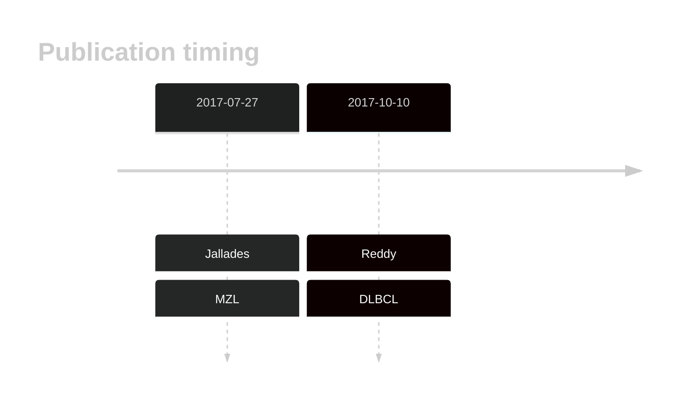

# HRAS

<<Warn("The variants reported in this gene in DLBCL failed QC")>>

## History

## Relevance tier by entity

|Entity|Tier|Description                              |
|:------:|:----:|-----------------------------------------|
||2|relevance in MZL not firmly established[@jalladesExomeSequencingIdentifies2017]|
| |3   |Retired, Failed QC[@reddyGeneticFunctionalDrivers2017]|

## Mutation incidence in large patient cohorts (GAMBL reanalysis)

|Entity|source        |frequency (%)|
|:------:|:--------------:|:-------------:|
|DLBCL |GAMBL genomes |  NA         |
|DLBCL |Schmitz cohort|0.21         |
|DLBCL |Reddy cohort  |0.70         |
|DLBCL |Chapuy cohort |0.43         |

## Mutation pattern and selective pressure estimates

|Entity|aSHM|Significant selection|dN/dS (missense)|dN/dS (nonsense)|
|:------:|:----:|:---------------------:|:----------------:|:----------------:|
|BL    |No  |No                   |0               |0               |
|DLBCL |No  |No                   |0               |0               |
|FL    |No  |No                   |0               |0               |

View coding variants in ProteinPaint [hg19](https://morinlab.github.io/LLMPP/GAMBL/HRAS_protein.html)  or [hg38](https://morinlab.github.io/LLMPP/GAMBL/HRAS_protein_hg38.html)

View all variants in GenomePaint [hg19](https://morinlab.github.io/LLMPP/GAMBL/HRAS.html)  or [hg38](https://morinlab.github.io/LLMPP/GAMBL/HRAS_hg38.html)

## HRAS Expression

<!-- ORIGIN: reddyGeneticFunctionalDrivers2017 -->
<!-- MZL: jalladesExomeSequencingIdentifies2017 -->
<!-- DLBCL: reddyGeneticFunctionalDrivers2017 -->

## All Mutations

[Reddy_2463T](https://www.bcgsc.ca/downloads/morinlab/GAMBL/Reddy/igv_reports/Reddy_2463T.html)
[Reddy_2565T](https://www.bcgsc.ca/downloads/morinlab/GAMBL/Reddy/igv_reports/Reddy_2565T.html)
[Reddy_2637T](https://www.bcgsc.ca/downloads/morinlab/GAMBL/Reddy/igv_reports/Reddy_2637T.html)
[Reddy_2643T](https://www.bcgsc.ca/downloads/morinlab/GAMBL/Reddy/igv_reports/Reddy_2643T.html)
[Reddy_2659T](https://www.bcgsc.ca/downloads/morinlab/GAMBL/Reddy/igv_reports/Reddy_2659T.html)
[Reddy_2777T](https://www.bcgsc.ca/downloads/morinlab/GAMBL/Reddy/igv_reports/Reddy_2777T.html)
[Reddy_2912T](https://www.bcgsc.ca/downloads/morinlab/GAMBL/Reddy/igv_reports/Reddy_2912T.html)
[Reddy_3385T](https://www.bcgsc.ca/downloads/morinlab/GAMBL/Reddy/igv_reports/Reddy_3385T.html)
[Reddy_3417T](https://www.bcgsc.ca/downloads/morinlab/GAMBL/Reddy/igv_reports/Reddy_3417T.html)
[Reddy_3482T](https://www.bcgsc.ca/downloads/morinlab/GAMBL/Reddy/igv_reports/Reddy_3482T.html)
[Reddy_3496T](https://www.bcgsc.ca/downloads/morinlab/GAMBL/Reddy/igv_reports/Reddy_3496T.html)
[Reddy_3537T](https://www.bcgsc.ca/downloads/morinlab/GAMBL/Reddy/igv_reports/Reddy_3537T.html)
[Reddy_3580T](https://www.bcgsc.ca/downloads/morinlab/GAMBL/Reddy/igv_reports/Reddy_3580T.html)
[Reddy_3631T](https://www.bcgsc.ca/downloads/morinlab/GAMBL/Reddy/igv_reports/Reddy_3631T.html)
[Reddy_3726T](https://www.bcgsc.ca/downloads/morinlab/GAMBL/Reddy/igv_reports/Reddy_3726T.html)
[Reddy_3751T](https://www.bcgsc.ca/downloads/morinlab/GAMBL/Reddy/igv_reports/Reddy_3751T.html)
[Reddy_3811T](https://www.bcgsc.ca/downloads/morinlab/GAMBL/Reddy/igv_reports/Reddy_3811T.html)
[Reddy_3845T](https://www.bcgsc.ca/downloads/morinlab/GAMBL/Reddy/igv_reports/Reddy_3845T.html)
[Reddy_3851T](https://www.bcgsc.ca/downloads/morinlab/GAMBL/Reddy/igv_reports/Reddy_3851T.html)

## References

