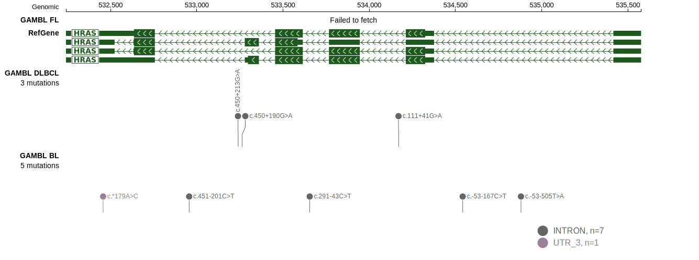

# HRAS

<<Warn("The variants reported in this gene in DLBCL failed QC")>>

## History

## Relevance tier by entity

|Entity|Tier|Description                              |
|:------:|:----:|-----------------------------------------|
||2|relevance in MZL not firmly established|
| |2   |relevance in DLBCL not firmly established|

## Mutation incidence in large patient cohorts (GAMBL reanalysis)

|Entity|source        |frequency (%)|
|:------:|:--------------:|:-------------:|
|DLBCL |GAMBL genomes |  NA         |
|DLBCL |Schmitz cohort|0.21         |
|DLBCL |Reddy cohort  |0.70         |
|DLBCL |Chapuy cohort |0.43         |

## Mutation pattern and selective pressure estimates

|Entity|aSHM|Significant selection|dN/dS (missense)|dN/dS (nonsense)|
|:------:|:----:|:---------------------:|:----------------:|:----------------:|
|BL    |No  |No                   |0               |0               |
|DLBCL |No  |No                   |0               |0               |
|FL    |No  |No                   |0               |0               |

View coding variants in ProteinPaint [hg19](https://morinlab.github.io/LLMPP/GAMBL/HRAS_protein.html)  or [hg38](https://morinlab.github.io/LLMPP/GAMBL/HRAS_protein_hg38.html)

View all variants in GenomePaint [hg19](https://morinlab.github.io/LLMPP/GAMBL/HRAS.html)  or [hg38](https://morinlab.github.io/LLMPP/GAMBL/HRAS_hg38.html)

## HRAS Expression

<!-- ORIGIN: reddyGeneticFunctionalDrivers2017 -->
<!-- MZL: jalladesExomeSequencingIdentifies2017 -->
<!-- DLBCL: reddyGeneticFunctionalDrivers2017 -->

## References
1.  Jallades L, Baseggio L, Sujobert P, Huet S, Chabane K, Callet-Bauchu E, Verney A, Hayette S, Desvignes JP, Salgado D, Levy N, Béroud C, Felman P, Berger F, Magaud JP, Genestier L, Salles G, Traverse-Glehen A. Exome sequencing identifies recurrent BCOR alterations and the absence of KLF2, TNFAIP3 and MYD88 mutations in splenic diffuse red pulp small B-cell lymphoma. Haematologica. 2017 Oct;102(10):1758–1766. PMCID: PMC5622860
2.  Reddy A, Zhang J, Davis NS, Moffitt AB, Love CL, Waldrop A, Leppa S, Pasanen A, Meriranta L, Karjalainen-Lindsberg ML, Nørgaard P, Pedersen M, Gang AO, Høgdall E, Heavican TB, Lone W, Iqbal J, Qin Q, Li G, Kim SY, Healy J, Richards KL, Fedoriw Y, Bernal-Mizrachi L, Koff JL, Staton AD, Flowers CR, Paltiel O, Goldschmidt N, Calaminici M, Clear A, Gribben J, Nguyen E, Czader MB, Ondrejka SL, Collie A, Hsi ED, Tse E, Au-Yeung RKH, Kwong YL, Srivastava G, Choi WWL, Evens AM, Pilichowska M, Sengar M, Reddy N, Li S, Chadburn A, Gordon LI, Jaffe ES, Levy S, Rempel R, Tzeng T, Happ LE, Dave T, Rajagopalan D, Datta J, Dunson DB, Dave SS. Genetic and Functional Drivers of Diffuse Large B Cell Lymphoma. Cell. 2017 Oct;171(2):481-494.e15. 
