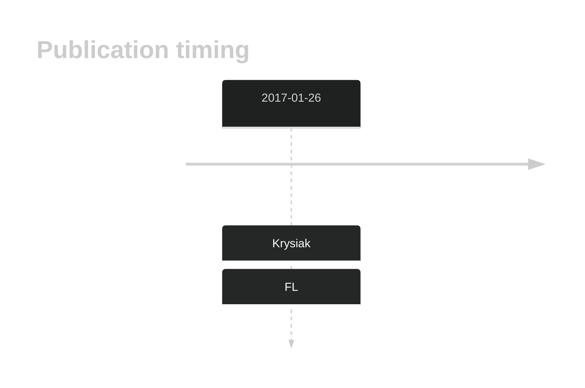

# HVCN1

## Overview
HVCN1, a voltage-gated proton channel, has been identified as recurrently mutated in follicular lymphoma and mutations also appear in some DLBCL.1 HVCN1 mutations disrupt its normal function, affecting B-cell receptor (BCR) signaling pathways.1 This gene has some recurrent sites of mutations (hot spots) but the function of these mutations is not well understood. The mutation pattern in DLBCL and FL implies the preferential accumulation of *inactivating mutations*.

## History

## Relevance tier by entity

|Entity|Tier|Description                           |
|:------:|:----:|--------------------------------------|
| |1   |high-confidence DLBCL gene            |
|    |1   |high-confidence FL gene               [@krysiakRecurrentSomaticMutations2017]|

## Mutation incidence in large patient cohorts (GAMBL reanalysis)

[[include:DLBCL_HVCN1.md]]
[[include:FL_HVCN1.md]]

## Mutation pattern and selective pressure estimates

[[include:dnds_HVCN1.md]]

## HVCN1 Hotspots

| Chromosome |Coordinate (hg19) | ref>alt | HGVSp | 
 | :---:| :---: | :--: | :---: |
| chr12 | 111099150 | T>G | Y42S |
| chr12 | 111099150 | T>C | Y42C |
| chr12 | 111099142 | A>T | W45R |

View coding variants in ProteinPaint [hg19](https://morinlab.github.io/LLMPP/GAMBL/HVCN1_protein.html)  or [hg38](https://morinlab.github.io/LLMPP/GAMBL/HVCN1_protein_hg38.html)

View all variants in GenomePaint [hg19](https://morinlab.github.io/LLMPP/GAMBL/HVCN1.html)  or [hg38](https://morinlab.github.io/LLMPP/GAMBL/HVCN1_hg38.html)

## HVCN1 Expression

<!-- ORIGIN: krysiakRecurrentSomaticMutations2017b -->
<!-- FL: krysiakRecurrentSomaticMutations2017b -->

## References
