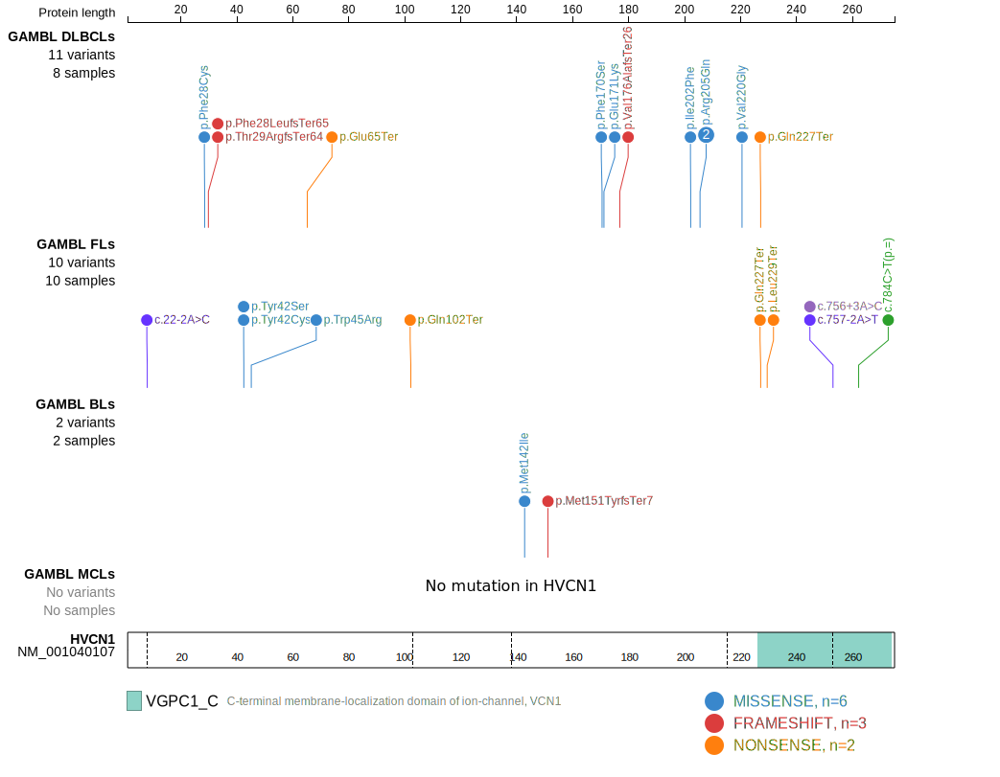
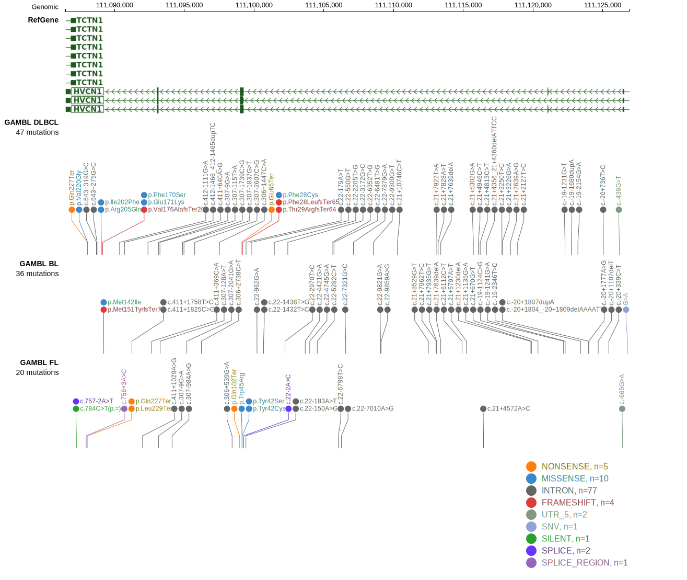
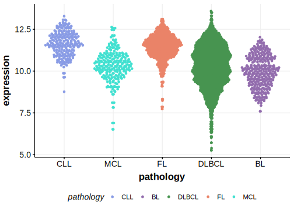

# HVCN1
## Overview
HVCN1, a voltage-gated proton channel, has been identified as recurrently mutated in follicular lymphoma and mutations also appear in some DLBCL.1 HVCN1 mutations disrupt its normal function, affecting B-cell receptor (BCR) signaling pathways.1 This gene has some recurrent sites of mutations (hot spots) but the function of these mutations is not well understood. The mutation pattern in DLBCL and FL implies the preferential accumulation of *inactivating mutations*.

## Relevance tier by entity

|Entity|Tier|Description                           |
|:------:|:----:|--------------------------------------|
|DLBCL |1   |high-confidence DLBCL gene            |
|FL    |1   |high-confidence FL gene               |
|BL    |2   |relevance in BL not firmly established|

## Mutation incidence in large patient cohorts (GAMBL reanalysis)

|Entity|source               |frequency (%)|
|:------:|:---------------------:|:-------------:|
|DLBCL |GAMBL genomes        |3.06         |
|DLBCL |Schmitz cohort       |1.91         |
|DLBCL |Reddy cohort         |2.30         |
|DLBCL |Chapuy cohort        |3.42         |
|FL    |GAMBL genomes        |6.47         |
|BL    |GAMBL genomes+capture|0.92         |
|BL    |Thomas cohort        |0.80         |
|BL    |Panea cohort         |2.00         |

## Mutation pattern and selective pressure estimates

|Entity|aSHM|Significant selection|dN/dS (missense)|dN/dS (nonsense)|
|:------:|:----:|:---------------------:|:----------------:|:----------------:|
|DLBCL |No  |Yes                  | 7.172          | 47.127         |
|FL    |No  |Yes                  |16.103          |259.368         |
|BL    |No  |No                   | 2.588          |  0.000         |

 ## HVCN1 Hotspots

| Chromosome |Coordinate (hg19) | ref>alt | HGVSp | 
 | :---:| :---: | :--: | :---: |
| chr12 | 111099150 | T>G | Y42S |
| chr12 | 111099150 | T>C | Y42C |
| chr12 | 111099142 | A>T | W45R |

View coding variants in ProteinPaint [hg19](https://morinlab.github.io/LLMPP/GAMBL/HVCN1_protein.html)  or [hg38](https://morinlab.github.io/LLMPP/GAMBL/HVCN1_protein_hg38.html)

View all variants in GenomePaint [hg19](https://morinlab.github.io/LLMPP/GAMBL/HVCN1.html)  or [hg38](https://morinlab.github.io/LLMPP/GAMBL/HVCN1_hg38.html)

## References
1. *Krysiak, K., Gomez, F., White, B., Matlock, M., Miller, C., Trani, L., Fronick, C., Fulton, R., Kreisel, F., Cashen, A., Carson, K., Berrien-Elliott, M., Bartlett, N., Griffith, M., Griffith, O., & Fehniger, T. (2017). Recurrent somatic mutations affecting B-cell receptor signaling pathway genes in follicular lymphoma.. Blood, 129 4, 473-483 . https://doi.org/10.1182/blood-2016-07-729954.*
## HVCN1 Expression

