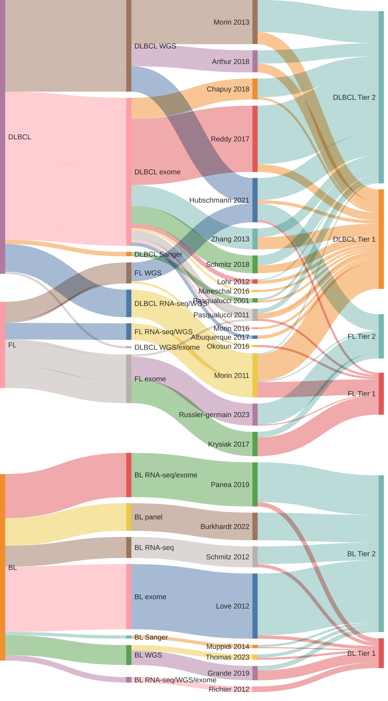
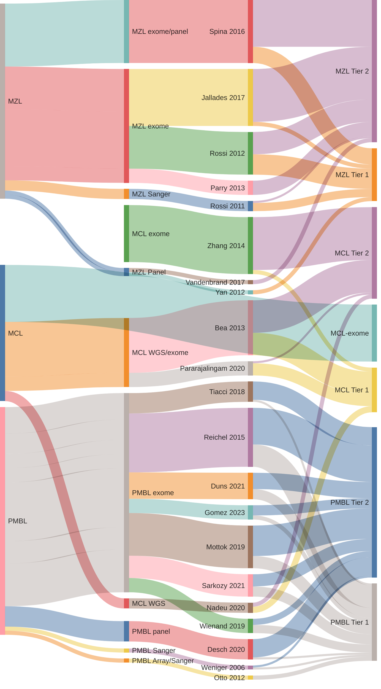

[[_TOC_]]

# Welcome to Lymphopedia!

This site provides a comprehensive annotated catalogue of genes that have been nominated as *recurrently mutated* in one of the [common](Home#common-b-cell-lymphomas) or [rare](Home#rare-b-cell-lymphomas) B-cell lymphomas. 
Each gene is [categorized](#categorization-of-genes) based on the level and quality of supporting data in the original study and other comparable datasets. 
Details for each gene can be found on their respective pages. The novel genes nominated by each study can be found on the study-centric pages. 

To get started, select one of the gene lists from the table below then select the `gene page` link for any gene in the table or explore the genes nominated by [individual studies](Papers).  

## Gene lists

### Common B-cell lymphomas

|Entity|Tier 1 (high-confidence)|Tier 2 (low-confidence)|Tier 3 (retired) |
|:-:|:-:|:-:|:-:|
|BL [(tsv)](https://raw.githubusercontent.com/morinlab/LLMPP/main/resources/curated/bl_genes.tsv)|[32 genes](BL_genes#tier-1-bl-genes)|[72 genes](BL_genes#tier-2-bl-genes)|[70 genes](BL_genes#tier-3-bl-genes)|
|DLBCL [(tsv)](https://raw.githubusercontent.com/morinlab/LLMPP/main/resources/curated/dlbcl_genes.tsv)|[125 genes](DLBCL_genes#tier-1-dlbcl-genes)|[210 genes](DLBCL_genes#tier-2-dlbcl-genes)|[387 genes](DLBCL_genes#tier-3-dlbcl-genes)|
|FL [(tsv)](https://raw.githubusercontent.com/morinlab/LLMPP/main/resources/curated/fl_genes.tsv)|[54 genes](FL_genes#tier-1-fl-genes)|[59 genes](FL_genes#tier-2-fl-genes)|[0 genes](FL_genes#tier-3-fl-genes)|
|PMBL[(tsv)](https://github.com/morinlab/LLMPP/blob/main/resources/curated/PMBL_HL_MGZL.tsv)|[76 genes](PMBL_genes#tier-1-pmbl-genes)|[82 genes](PMBL_genes#tier-2-pmbl-genes)|0 genes|
|MCL [(tsv)](https://github.com/morinlab/LLMPP/blob/main/resources/curated/mcl_genes.tsv)|[23 genes](MCL_genes#tier-1-mcl-genes)|[46 genes](MCL_genes#tier-2-mcl-genes)|[0 genes](MCL_genes#tier-3-mcl-genes)|
|MZL [(tsv)](https://github.com/morinlab/LLMPP/blob/main/resources/curated/mzl_genes.tsv)|[42 genes](MZL_genes#tier-1-mzl-genes)|[74 genes](MZL_genes#tier-2-mzl-genes)|[0 genes](MZL_genes#tier-3-mzl-genes)|

\* *PMBL gene list includes genes attributed to classical Hodgkin lymphoma or marginal grey-zone lymphoma*

[Combined gene list](DLBCL_FL_BL)

## aSHM targets

[hg19 coordinates](ashm)

[hg38 coordinates](ashm_hg38)

## History

### DLBCL, FL and BL

### History of lymphoma genes in rare entities

## Origins of the individual lymphoma genes

### [All studies](Papers.md)

### Studies selected for manual review

|Study|Sequencing Method|Entity|Tier 1 genes contributed|Genes failing QC|
|:---:|:--:|:-:|:-:|:-:|
|[@loveGeneticLandscapeMutations2012](papers/loveGeneticLandscapeMutations2012)|Exome|BL|3|48 (84%)|
|[@morinMutationalStructuralAnalysis2013](papers/morinMutationalStructuralAnalysis2013)|WGS|DLBCL|9|7 (24%)|
|[@reddyGeneticFunctionalDrivers2017](papers/reddyGeneticFunctionalDrivers2017)|Exome|DLBCL|6|29 (55%)|
|[@paneaWholeGenomeLandscape2019](papers/paneaWholeGenomeLandscape2019)|Exome/RNA-seq|BL|4|22 (55%)|
|[@chapuyMolecularSubtypesDiffuse2018](papers/chapuyMolecularSubtypesDiffuse2018)|Exome|DLBCL|2| 7 (41%) |
|[@hubschmannMutationalMechanismsShaping2021](papers/hubschmannMutationalMechanismsShaping2021)|WGS|DLBCL,FL|4|3 (9%)|

## Categorization of genes

### Tiers

**Tier 2** - Any gene described as significantly or recurrently mutated in one or more types of B-cell lymphoma is initially assigned to Tier 2 for that entity. The study describing the mutation of that gene in a particular entity is considered the originating study.

**Tier 1** - Genes can transition to Tier 1 only after additional studies have demonstrated the recurrence of mutations in the same entity.

**Tier 3** - Tier 3 is reserved for genes that were once nominated as a driver but have since been retired due to a lack of support in the original study nominating them.

For more details, visit (this page)(Supplemental_Methods_and_Results)

## Other resources available for each gene

### B-cell lymphoma genome browser

### Gene expression overview

## References

