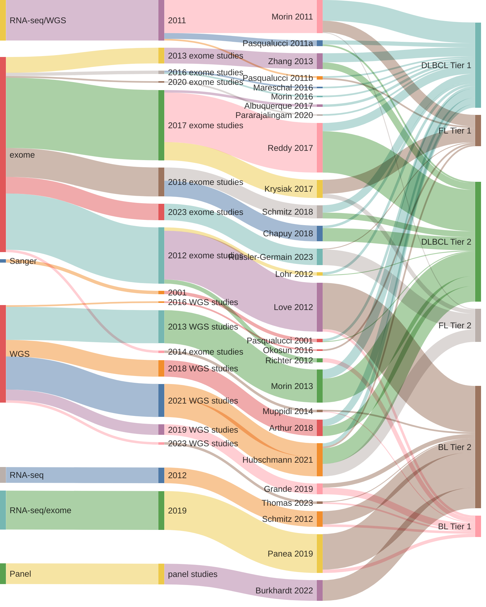

# Audit of B-cell Cancer Genes

This project tracks all genes that have been nominated as drivers (recurrent targets of mutation) in a variety of B-cell lymphomas and their level of support based on available datasets. The pattern 
of mutations in each gene can be found through the gene lists (below). Additional information for each gene can be found on their respective pages. To get started, select one of the gene lists from the table below then select the `gene page` link for any gene in the table.  

## B-cell Lymphoma gene lists
| entity | Tier 1 (high-confidence) | Tier 2 (low-confidence) |
| ----- | ----------- | ---------- |
| DLBCL | [(128 genes)](DLBCL_genes#tier-1-dlbcl-genes) |[(198 genes)](DLBCL_genes#tier-2-dlbcl-genes) |
| FL | [(66 genes)](FL_genes#tier-1-fl-genes) |[(50 genes)](FL_genes#tier-2-fl-genes) |
| BL | [(29 genes)](BL_genes#tier-1-bl-genes) |[(157 genes)](BL_genes#tier-2-bl-genes) |
| MCL | [(23 genes)](MCL_genes#tier-1-mcl-genes) |[(46 genes)](MCL_genes#tier-2-mcl-genes) |

## Origins of B-cell lymphoma gene lists

## B-cell Lymphoma aSHM targets
[hg19 coordinates](ashm)

[hg38 coordinates](ashm_hg38)

## B-cell lymphoma mutation browser

## Gene expression distributions across B-cell lymphomas

