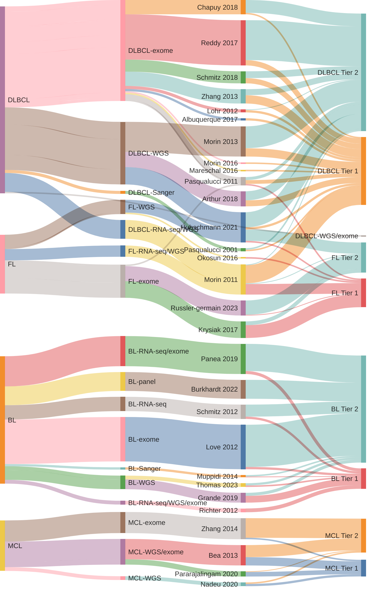
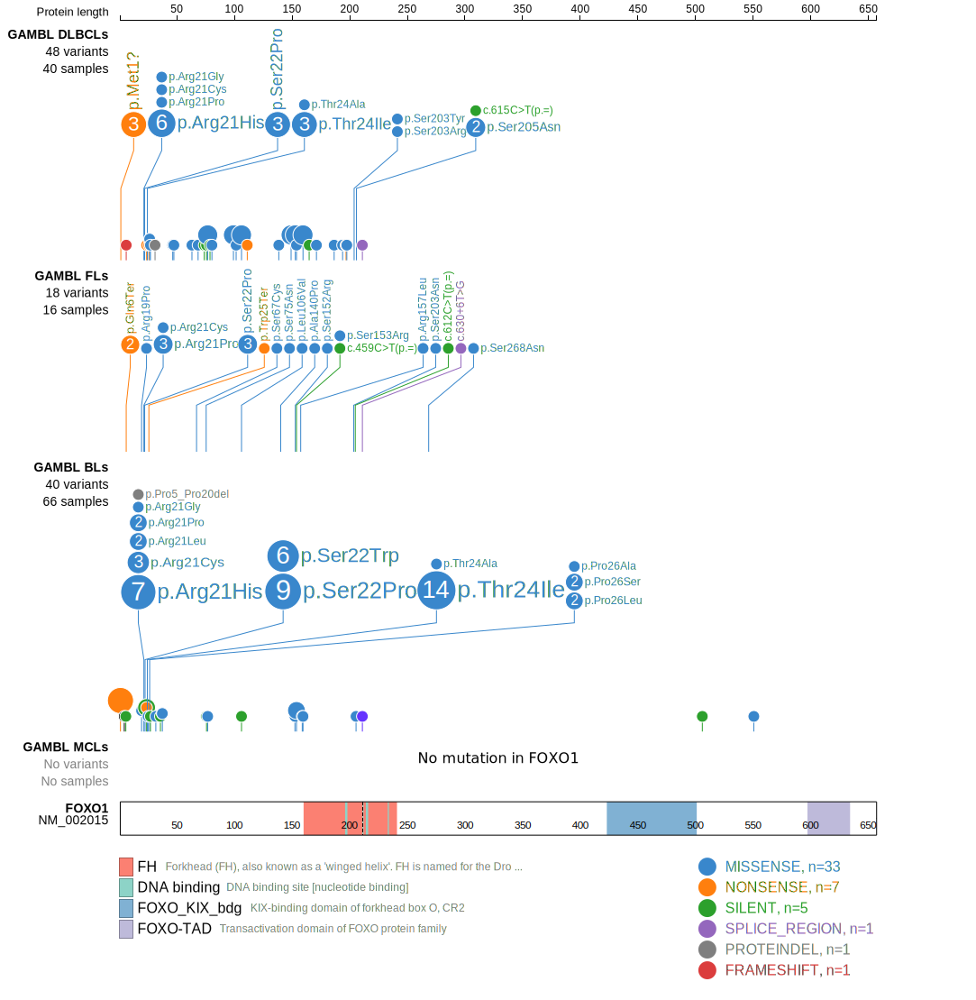

# Welcome to Lymphopedia!

This site tracks all genes that have been nominated as recurrently mutated in one of the common B-cell lymphomas. Genes are categorized based on their level of support in the original primary data and other available datasets. Information for each gene can be found on their respective pages. The genes nominated by individual studies can be found on the study-centric pages.

To get started, select one of the gene lists from the table below then select the `gene page` link for any gene in the table or explore the genes nominated by [individual studies](Papers).  

## Categorization

### Gene Tiers

**Tier 2** - Any gene described as significantly or recurrently mutated in one or more types of B-cell lymphoma is initially assigned to Tier 2 for that entity. The study describing the mutation of that gene in a particular entity is considered the originating study. 

**Tier 1** - Genes can transition to Tier 1 only after additional studies have demonstrated the recurrence of mutations in the same entity.  

### Gene Designations

**aSHM** - Denotes genes documented as being affected by aberrant somatic hypermutation (aSHM). Tier 1 and Tier 2 genes can have this designation, respectively abbreviated as *1-a* and *2-a*. For example, see [BCL7A](BCL7A).

## Gene lists

|entity|Tier 1|Tier 2|
|:-:|:-:|:-:|
|Burkitt Lymphoma (BL)|[29 genes](BL_genes#tier-1-bl-genes)|[157 genes](BL_genes#tier-2-bl-genes)|
|Diffuse Large B-cell Lymphoma(DLBCL)|[128 genes](DLBCL_genes#tier-1-dlbcl-genes)|[198 genes](DLBCL_genes#tier-2-dlbcl-genes)|
|Follicular Lymphoma (FL)|[66 genes](FL_genes#tier-1-fl-genes)|[50 genes](FL_genes#tier-2-fl-genes)|
|Primary Mediastinal B-cell Lymphoma (PMBL)\*|[76 genes](PMBL_genes#tier-1-pmbl-genes)|[82 genes](PMBL_genes#tier-2-pmbl-genes)|
|Mantle Cell Lymphoma (MCL)|[23 genes](MCL_genes#tier-1-mcl-genes)|[46 genes](MCL_genes#tier-2-mcl-genes)|
|Marginal Zone Lymphoma (MZL)|[42 genes](MZL_genes#tier-1-mzl-genes)|[74 genes](MZL_genes#tier-2-mzl-genes)|

\* *PMBL gene list includes genes attributed to classical Hodgkin lymphoma or marginal grey-zone lymphoma*

## B-cell Lymphoma aSHM targets

[hg19 coordinates](ashm)

[hg38 coordinates](ashm_hg38)

## Origins of B-cell lymphoma gene lists

### [Browse by study](Papers)

## B-cell lymphoma mutation browser

## Gene expression distributions across B-cell lymphomas

