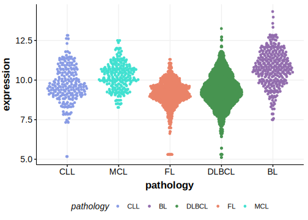

[[_TOC_]]

## Overview

ID3 was first reported as mutated in BL in 2012 by Richter et al.[@richterRecurrentMutationID32012] 
The existence of mutations in DLBCL were described in 2012 by Schmitz et al[@schmitzBurkittLymphomaPathogenesis2012] and later in MZL by Spina et al.[@spinaGeneticsNodalMarginal2016]

## Relevance tier by entity

[[include:table1_ID3]]

## Mutation incidence in large patient cohorts (GAMBL reanalysis)

[[include:tables/DLBCL_ID3.md]]
[[include:tables/BL_ID3.md]]

## Mutation pattern and selective pressure estimates

[[include:tables/dnds_ID3.md]]

## aSHM regions

|chr_name|hg19_start|hg19_end|region                                                                                   |regulatory_comment|
|:--------:|:----------:|:--------:|:-----------------------------------------------------------------------------------------:|:------------------:|
|chr1    |23885584  |23885835|[TSS](https://genome.ucsc.edu/s/rdmorin/GAMBL%20hg19?position=chr1%3A23885584%2D23885835)|NA                |

[[include:browser_ID3.md]]

## Expression

[[include:mermaid_ID3.md]]

## References

<!-- ORIGIN: 22885699 -->
<!-- BL: richterRecurrentMutationID32012a -->
<!-- DLBCL: schmitzBurkittLymphomaPathogenesis2012 -->
<!-- MZL: spinaGeneticsNodalMarginal2016b -->
