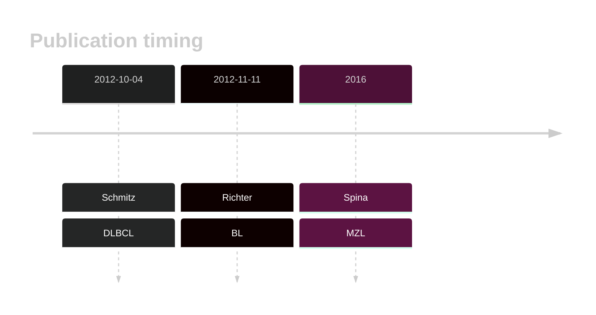

# ID3

## History
ID3 was first reported as mutated in BL in 2012 by Richter et al.[@richterRecurrentMutationID32012] 
The existence of mutations in DLBCL were described in 2012 by Schmitz et al[@schmitzBurkittLymphomaPathogenesis2012] and later in MZL by Spina et al.[@spinaGeneticsNodalMarginal2016]

## Relevance tier by entity

|Entity|Tier|Description                              |
|:------:|:----:|-----------------------------------------|
|    |1 | high-confidence BL gene [@richterRecurrentMutationID32012a]|
| |1 | high-confidence MZL gene [@spinaGeneticsNodalMarginal2016b]|
| |2 | Although recurrent, the relevance of mutations in DLBCL is tenuous[@schmitzBurkittLymphomaPathogenesis2012]|

## Mutation incidence in large patient cohorts (GAMBL reanalysis)

|Entity|source               |frequency (%)|
|:------:|:---------------------:|:-------------:|
|BL    |GAMBL genomes+capture|45.50        |
|BL    |Thomas cohort        |47.00        |
|BL    |Panea cohort         |31.70        |
|DLBCL |GAMBL genomes        | 1.53        |
|DLBCL |Schmitz cohort       | 4.68        |
|DLBCL |Reddy cohort         | 3.50        |
|DLBCL |Chapuy cohort        | 0.85        |
|FL    |GAMBL genomes        | 0.92        |

## Mutation pattern and selective pressure estimates

|Entity|aSHM|Significant selection|dN/dS (missense)|dN/dS (nonsense)|
|:------:|:----:|:---------------------:|:----------------:|:----------------:|
|BL    |Yes |Yes                  |42.419          |439.808         |
|DLBCL |Yes |Yes                  | 0.000          | 30.520         |
|FL    |Yes |No                   | 3.497          |  0.000         |

## aSHM regions

|chr_name|hg19_start|hg19_end|region                                                                                   |regulatory_comment|
|:--------:|:----------:|:--------:|:-----------------------------------------------------------------------------------------:|:------------------:|
|chr1    |23885584  |23885835|[TSS](https://genome.ucsc.edu/s/rdmorin/GAMBL%20hg19?position=chr1%3A23885584%2D23885835)|NA                |

View coding variants in ProteinPaint [hg19](https://morinlab.github.io/LLMPP/GAMBL/ID3_protein.html)  or [hg38](https://morinlab.github.io/LLMPP/GAMBL/ID3_protein_hg38.html)

View all variants in GenomePaint [hg19](https://morinlab.github.io/LLMPP/GAMBL/ID3.html)  or [hg38](https://morinlab.github.io/LLMPP/GAMBL/ID3_hg38.html)

## ID3 Expression

## References

<!-- ORIGIN: 22885699 -->
<!-- BL: richterRecurrentMutationID32012a -->
<!-- DLBCL: schmitzBurkittLymphomaPathogenesis2012 -->
<!-- MZL: spinaGeneticsNodalMarginal2016b -->
