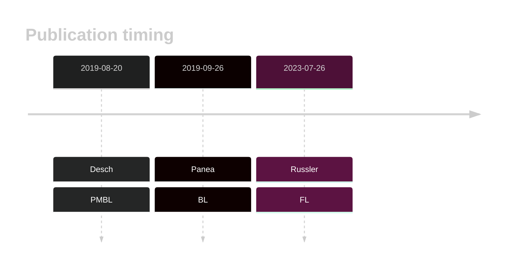
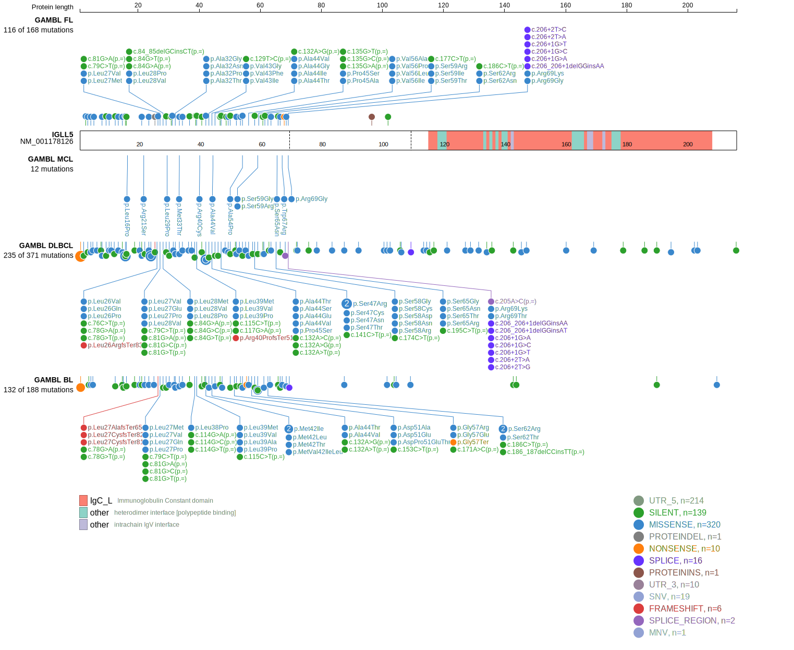

# IGLL5

## History

## Relevance tier by entity

|Entity|Tier|Description                              |
|:------:|:----:|-----------------------------------------|
||2|relevance in PMBL/cHL/GZL not firmly established|
|    |2-a | aSHM target; Although recurrent, the relevance of mutations in BL is tenuous    |
| |2-a | aSHM target; Although recurrent, the relevance of mutations in DLBCL is tenuous |
|    |2-a | aSHM target; Although recurrent, the relevance of mutations in FL is tenuous    |

## Mutation incidence in large patient cohorts (GAMBL reanalysis)

|Entity|source               |frequency (%)|
|:------:|:---------------------:|:-------------:|
|BL    |GAMBL genomes+capture|26.33        |
|BL    |Thomas cohort        |25.00        |
|BL    |Panea cohort         |23.80        |
|DLBCL |GAMBL genomes        |41.49        |
|DLBCL |Schmitz cohort       |35.96        |
|DLBCL |Reddy cohort         |16.12        |
|DLBCL |Chapuy cohort        | 8.97        |
|FL    |GAMBL genomes        |35.33        |

## Mutation pattern and selective pressure estimates

|Entity|aSHM|Significant selection|dN/dS (missense)|dN/dS (nonsense)|
|:------:|:----:|:---------------------:|:----------------:|:----------------:|
|BL    |Yes |Yes                  |7.850           |3.210           |
|DLBCL |Yes |Yes                  |3.376           |5.315           |
|FL    |Yes |Yes                  |4.830           |9.846           |

## aSHM regions

|chr_name|hg19_start|hg19_end|region                                                                                    |regulatory_comment|
|:--------:|:----------:|:--------:|:------------------------------------------------------------------------------------------:|:------------------:|
|chr22   |23229554  |23232042|[TSS](https://genome.ucsc.edu/s/rdmorin/GAMBL%20hg19?position=chr22%3A23229554%2D23232042)|NA                |

View coding variants in ProteinPaint [hg19](https://morinlab.github.io/LLMPP/GAMBL/IGLL5_protein.html)  or [hg38](https://morinlab.github.io/LLMPP/GAMBL/IGLL5_protein_hg38.html)

View all variants in GenomePaint [hg19](https://morinlab.github.io/LLMPP/GAMBL/IGLL5.html)  or [hg38](https://morinlab.github.io/LLMPP/GAMBL/IGLL5_hg38.html)

## IGLL5 Expression

## References
1.  Desch AK, Hartung K, Botzen A, Brobeil A, Rummel M, Kurch L, Georgi T, Jox T, Bielack S, Burdach S, Classen CF, Claviez A, Debatin KM, Ebinger M, Eggert A, Faber J, Flotho C, Frühwald M, Graf N, Jorch N, Kontny U, Kramm C, Kulozik A, Kühr J, Sykora KW, Metzler M, Müller HL, Nathrath M, Nüßlein T, Paulussen M, Pekrun A, Reinhardt D, Reinhard H, Rössig C, Sauerbrey A, Schlegel PG, Schneider DT, Scheurlen W, Schweigerer L, Simon T, Suttorp M, Vorwerk P, Schmitz R, Kluge R, Mauz-Körholz C, Körholz D, Gattenlöhner S, Bräuninger A. Genotyping circulating tumor DNA of pediatric Hodgkin lymphoma. Leukemia. 2020 Jan;34(1):151–166. PMID: 31431735
2.  Panea R, Love C, Shingleton JR, Reddy A, Bailey J, Moormann A, Otieno J, Ong’echa J, Oduor C, Schroêder K, Masalu N, Chao N, Agajanian M, Major M, Fedoriw Y, Richards K, Rymkiewicz G, Miles R, Alobeid B, Bhagat G, Flowers C, Ondrejka S, Hsi E, Choi W, Au-Yeung R, Hartmann W, Lenz G, Meyerson H, Lin YY, Zhuang Y, Luftig M, Waldrop A, Dave T, Thakkar D, Sahay H, Li G, Palus B, Seshadri V, Kim S, Gascoyne R, Levy S, Mukhopadhyay M, Dunson D, Dave S. The whole genome landscape of Burkitt lymphoma subtypes. Blood. 2019; 
3.  Russler-Germain DA, Krysiak K, Ramirez CA, Mosior M, Watkins MP, Gomez F, Skidmore ZL, Trani L, Gao F, Geyer S, Cashen A, Mehta-Shah N, Kahl B, Bartlett N, Alderuccio J, Lossos I, Ondrejka S, Hsi E, Martin P, Leonard J, Griffith M, Griffith O, Fehniger T. Mutations associated with progression in follicular lymphoma predict inferior outcomes at diagnosis: Alliance A151303. Blood Advances. 2023;7:5524–5539. 
<!-- PMBL: deschGenotypingCirculatingTumor2020 -->
<!-- ORIGIN: deschGenotypingCirculatingTumor2020 -->
<!-- BL: paneaWholeGenomeLandscape2019 -->
<!-- FL: russler-germainMutationsAssociatedProgression2023b -->
<!-- BL: paneaWholeGenomeLandscape2019 -->
