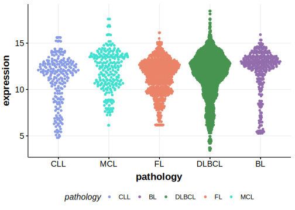

[[_TOC_]]

## Relevance tier by entity

[[include:table1_IGLL5]]

## Mutation incidence in large patient cohorts (GAMBL reanalysis)

[[include:tables/DLBCL_IGLL5]]
[[include:tables/BL_IGLL5]]
[[include:tables/FL_IGLL5]]

## Mutation pattern and selective pressure estimates

[[include:tables/dnds_IGLL5.md]]

## aSHM regions

|chr_name|hg19_start|hg19_end|region                                                                                    |regulatory_comment|
|:--------:|:----------:|:--------:|:------------------------------------------------------------------------------------------:|:------------------:|
|chr22   |23229554  |23232042|[TSS](https://genome.ucsc.edu/s/rdmorin/GAMBL%20hg19?position=chr22%3A23229554%2D23232042)|NA                |

[[include:browser_IGLL5.md]]

## Expression

[[include:mermaid_IGLL5.md]]

## References
<!-- PMBL: deschGenotypingCirculatingTumor2020 -->
<!-- ORIGIN: deschGenotypingCirculatingTumor2020 -->
<!-- BL: paneaWholeGenomeLandscape2019 -->
<!-- FL: russler-germainMutationsAssociatedProgression2023b -->
<!-- BL: paneaWholeGenomeLandscape2019 -->
