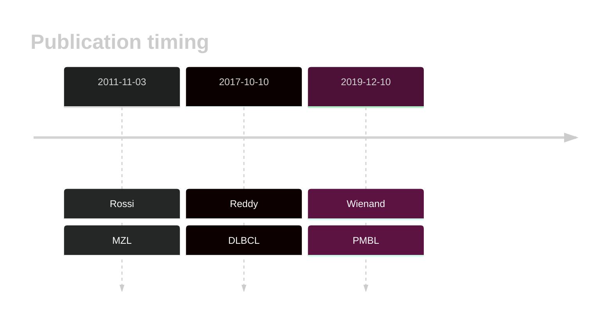

# IKBKB

## History

## Relevance tier by entity

|Entity|Tier|Description                              |
|:------:|:----:|-----------------------------------------|
||2|relevance in PMBL/cHL/GZL not firmly established|
||2|relevance in MZL not firmly established|
| |2   |relevance in DLBCL not firmly established|

## Mutation incidence in large patient cohorts (GAMBL reanalysis)

|Entity|source        |frequency (%)|
|:------:|:--------------:|:-------------:|
|DLBCL |GAMBL genomes |0.57         |
|DLBCL |Schmitz cohort|2.98         |
|DLBCL |Reddy cohort  |1.10         |
|DLBCL |Chapuy cohort |3.42         |

## Mutation pattern and selective pressure estimates

|Entity|aSHM|Significant selection|dN/dS (missense)|dN/dS (nonsense)|
|:------:|:----:|:---------------------:|:----------------:|:----------------:|
|BL    |No  |No                   |4.726           |0               |
|DLBCL |No  |No                   |1.593           |0               |
|FL    |No  |No                   |3.189           |0               |

View coding variants in ProteinPaint [hg19](https://morinlab.github.io/LLMPP/GAMBL/IKBKB_protein.html)  or [hg38](https://morinlab.github.io/LLMPP/GAMBL/IKBKB_protein_hg38.html)

View all variants in GenomePaint [hg19](https://morinlab.github.io/LLMPP/GAMBL/IKBKB.html)  or [hg38](https://morinlab.github.io/LLMPP/GAMBL/IKBKB_hg38.html)

## IKBKB Expression

<!-- ORIGIN: rossiAlterationBIRC3Multiple2011a -->
<!-- MZL: rossiAlterationBIRC3Multiple2011a -->
<!-- DLBCL: reddyGeneticFunctionalDrivers2017 -->
<!-- PMBL: wienandGenomicAnalysesFlowsorted2019b -->

## References
1.  Rossi D, Deaglio S, Dominguez-Sola D, Rasi S, Vaisitti T, Agostinelli C, Spina V, Bruscaggin A, Monti S, Cerri M, Cresta S, Fangazio M, Arcaini L, Lucioni M, Marasca R, Thieblemont C, Capello D, Facchetti F, Kwee I, Pileri SA, Foà R, Bertoni F, Dalla-Favera R, Pasqualucci L, Gaidano G. Alteration of BIRC3 and multiple other NF-κB pathway genes in splenic marginal zone lymphoma. Blood. 2011 Nov 3;118(18):4930–4934. PMID: 21881048
2.  Reddy A, Zhang J, Davis NS, Moffitt AB, Love CL, Waldrop A, Leppa S, Pasanen A, Meriranta L, Karjalainen-Lindsberg ML, Nørgaard P, Pedersen M, Gang AO, Høgdall E, Heavican TB, Lone W, Iqbal J, Qin Q, Li G, Kim SY, Healy J, Richards KL, Fedoriw Y, Bernal-Mizrachi L, Koff JL, Staton AD, Flowers CR, Paltiel O, Goldschmidt N, Calaminici M, Clear A, Gribben J, Nguyen E, Czader MB, Ondrejka SL, Collie A, Hsi ED, Tse E, Au-Yeung RKH, Kwong YL, Srivastava G, Choi WWL, Evens AM, Pilichowska M, Sengar M, Reddy N, Li S, Chadburn A, Gordon LI, Jaffe ES, Levy S, Rempel R, Tzeng T, Happ LE, Dave T, Rajagopalan D, Datta J, Dunson DB, Dave SS. Genetic and Functional Drivers of Diffuse Large B Cell Lymphoma. Cell. 2017 Oct;171(2):481-494.e15. 
3.  Wienand K, Chapuy B, Stewart C, Dunford AJ, Wu D, Kim J, Kamburov A, Wood TR, Cader FZ, Ducar MD, Thorner AR, Nag A, Heubeck AT, Buonopane MJ, Redd RA, Bojarczuk K, Lawton LN, Armand P, Rodig SJ, Fromm JR, Getz G, Shipp MA. Genomic analyses of flow-sorted Hodgkin Reed-Sternberg cells reveal complementary mechanisms of immune evasion. Blood Adv. 2019 Dec 10;3(23):4065–4080. PMCID: PMC6963251
