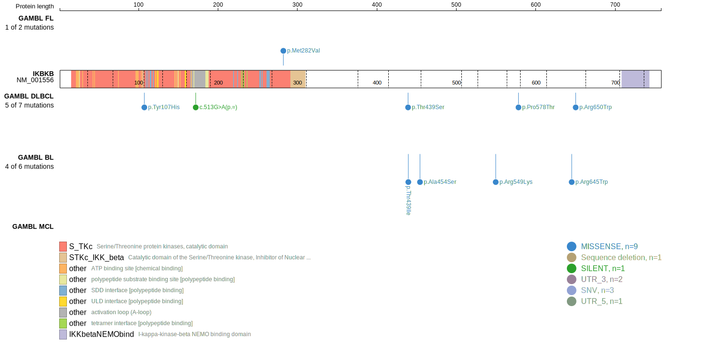
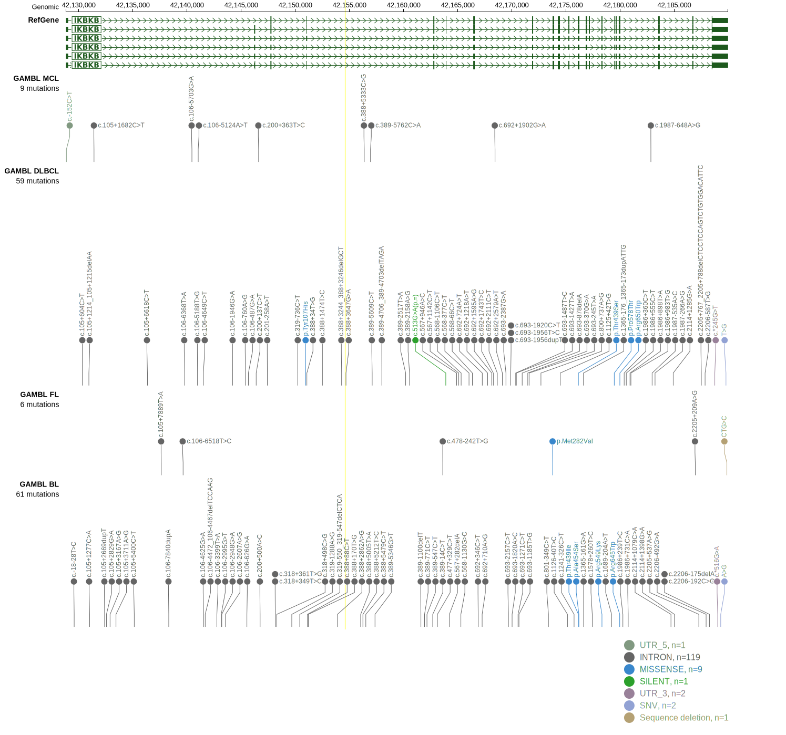
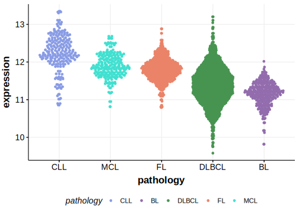

[[_TOC_]]

## Relevance tier by entity

|Entity|Tier|Description                              |
|:------:|:----:|-----------------------------------------|
||2|relevance in PMBL/cHL/GZL not firmly established[@wienandGenomicAnalysesFlowsorted2019]|
||2|relevance in MZL not firmly established[@rossiAlterationBIRC3Multiple2011]|
| |2   |relevance in DLBCL not firmly established[@reddyGeneticFunctionalDrivers2017]|

## Mutation incidence in large patient cohorts (GAMBL reanalysis)

|Entity|source        |frequency (%)|
|:------:|:--------------:|:-------------:|
|DLBCL |GAMBL genomes |0.57         |
|DLBCL |Schmitz cohort|2.98         |
|DLBCL |Reddy cohort  |1.10         |
|DLBCL |Chapuy cohort |3.42         |

## Mutation pattern and selective pressure estimates

[[include:dnds_IKBKB.md]]

View coding variants in ProteinPaint [hg19](https://morinlab.github.io/LLMPP/GAMBL/IKBKB_protein.html)  or [hg38](https://morinlab.github.io/LLMPP/GAMBL/IKBKB_protein_hg38.html)

View all variants in GenomePaint [hg19](https://morinlab.github.io/LLMPP/GAMBL/IKBKB.html)  or [hg38](https://morinlab.github.io/LLMPP/GAMBL/IKBKB_hg38.html)

## IKBKB Expression

<!-- ORIGIN: rossiAlterationBIRC3Multiple2011a -->
<!-- MZL: rossiAlterationBIRC3Multiple2011a -->
<!-- DLBCL: reddyGeneticFunctionalDrivers2017 -->
<!-- PMBL: wienandGenomicAnalysesFlowsorted2019b -->

[[include:mermaid_IKBKB.md]]

## References
