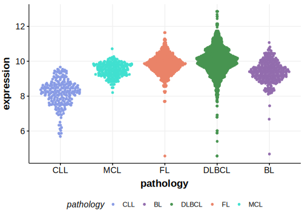

[[_TOC_]]

## Overview

Mutations in this gene were first described in DLBCL and FL in 2021 by Hübschmann et al.[[@hubschmannMutationalMechanismsShaping2021]]

## Relevance tier by entity

[[include:table1_IKBKE.md]]

## Mutation incidence in large patient cohorts (GAMBL reanalysis)

|Entity|source        |frequency (%)|
|:------:|:--------------:|:-------------:|
|DLBCL |GAMBL genomes |0.76         |
|DLBCL |Schmitz cohort|1.06         |
|DLBCL |Reddy cohort  |1.00         |
|DLBCL |Chapuy cohort |2.14         |

## Mutation pattern and selective pressure estimates

[[include:dnds_IKBKE.md]]

[[include:browser_IKBKE.md]]

## Expression

## All Mutations

[SP193347](https://www.bcgsc.ca/downloads/morinlab/GAMBL/MALY/SP193347.html)
[SP124977](https://www.bcgsc.ca/downloads/morinlab/GAMBL/MALY/SP124977.html)
[SP116668](https://www.bcgsc.ca/downloads/morinlab/GAMBL/MALY/SP116668.html)

[[include:mermaid_IKBKE.md]]

## References

<!-- ORIGIN: hubschmannMutationalMechanismsShaping2021b -->
<!-- DLBCL: hubschmannMutationalMechanismsShaping2021b -->
