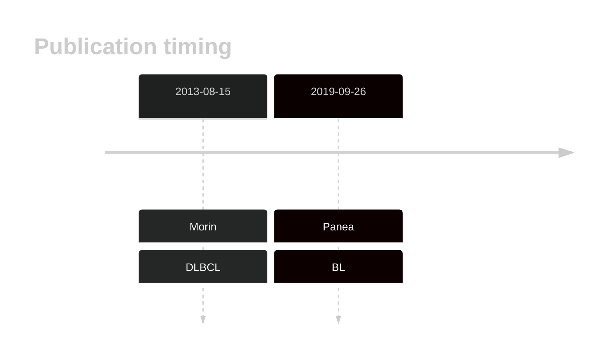
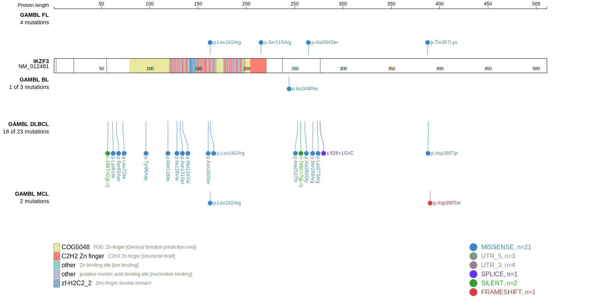
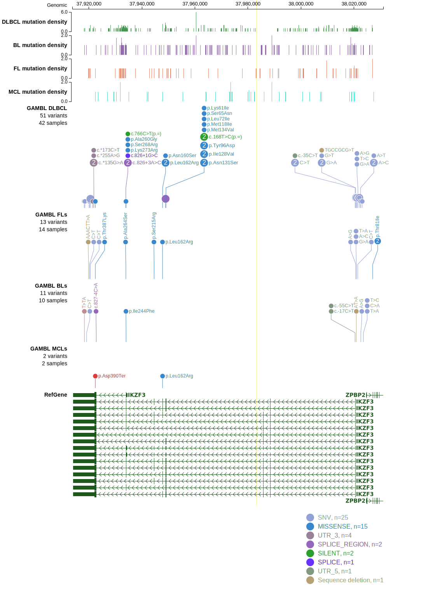

# IKZF3

## Overview
IKZF3 (IKAROS family zinc finger 3, also known as AIOLOS) is a transcription factor involved in regulating B-cell development and function. Mutations in IKZF3 can lead to transcriptional dysregulation and contribute to the pathogenesis of B-cell neoplasms. IKZF3 is one of [a number of genes](https://github.com/morinlab/LLMPP/wiki/ashm) affected by aberrant somatic hypermutation in B-cell lymphomas, which complicates the interpretation of mutations at this locus. IKZF3 has multiple hot spot mutations in DLBCL. The most common, L162R, has been identified as a driver in CLL. In that context, it alters DNA binding specificity and causes hyperactivation of B-cell receptor (BCR) signaling and overexpression of NF-κB target genes.1 While primarily studied in CLL, the functional effects of IKZF3 mutations could have implications for other B-cell malignancies, including DLBCL 
## History

## Relevance tier by entity

|Entity|Tier|Description                           |
|:------:|:----:|--------------------------------------|
|    |2-a | aSHM target; Although recurrent, the relevance of mutations in BL is tenuous |
| |1-a | aSHM target and high-confidence DLBCL gene            |

## Mutation incidence in large patient cohorts (GAMBL reanalysis)

|Entity|source               |frequency (%)|
|:------:|:---------------------:|:-------------:|
|BL    |GAMBL genomes+capture|1.62         |
|BL    |Thomas cohort        |0.80         |
|BL    |Panea cohort         |3.00         |
|DLBCL |GAMBL genomes        |4.78         |
|DLBCL |Schmitz cohort       |4.47         |
|DLBCL |Reddy cohort         |3.90         |
|DLBCL |Chapuy cohort        |4.27         |

## Mutation pattern and selective pressure estimates

|Entity|aSHM|Significant selection|dN/dS (missense)|dN/dS (nonsense)|
|:------:|:----:|:---------------------:|:----------------:|:----------------:|
|BL    |Yes |No                   | 1.552          |0               |
|DLBCL |Yes |No                   |10.924          |0               |
|FL    |Yes |No                   | 7.180          |0               |

## aSHM regions

|chr_name|hg19_start|hg19_end|region                                                                                      |regulatory_comment|
|:--------:|:----------:|:--------:|:--------------------------------------------------------------------------------------------:|:------------------:|
|chr17   |37928959  |37940119|[TSS-1](https://genome.ucsc.edu/s/rdmorin/GAMBL%20hg19?position=chr17%3A37928959%2D37940119)|NA                |
|chr17   |38015776  |38024832|[TSS-2](https://genome.ucsc.edu/s/rdmorin/GAMBL%20hg19?position=chr17%3A38015776%2D38024832)|NA                |

 ## IKZF3 Hotspots

| Chromosome |Coordinate (hg19) | ref>alt | HGVSp | 
 | :---:| :---: | :--: | :---: |
|chr17|37948968|T>C|I128V| 
|chr17|37948958|T>C|N131S| 
|chr17|37948950|T>C|M134V| 
|chr17|37948949|A>T|M134K| 
|chr17|37947783|T>G|N160H| 
|chr17|37947782|T>C|N160S| 
|chr17|37947776|A>C|L162R| 
|chr17|37944583|G>T|Q213K| 
|chr17|37944582|T>C|Q213R| 
|chr17|37944577|T>G|S215R| 
|chr17|37944575|A>T|S215R| 
|chr17|37944575|A>C|S215R| 
|chr17|37944568|C>T|E218K| 
|chr17|37944565|C>T|E219K| 
|chr17|37944564|T>A|E219V| 
|chr17|37944556|C>T|E222K| 

View coding variants in ProteinPaint [hg19](https://morinlab.github.io/LLMPP/GAMBL/IKZF3_protein.html)  or [hg38](https://morinlab.github.io/LLMPP/GAMBL/IKZF3_protein_hg38.html)

View all variants in GenomePaint [hg19](https://morinlab.github.io/LLMPP/GAMBL/IKZF3.html)  or [hg38](https://morinlab.github.io/LLMPP/GAMBL/IKZF3_hg38.html)

## References
1. *Lazarian, G., Yin, S., Hacken, E., Sewastianik, T., Uduman, M., Font-Tello, A., Gohil, S., Li, S., Kim, E., Joyal, H., Billington, L., Witten, E., Zheng, M., Huang, T., Severgnini, M., Lefebvre, V., Rassenti, L., Gutierrez, C., Georgopoulos, K., Ott, C., Wang, L., Kipps, T., Burger, J., Livak, K., Neuberg, D., Baran-Marszak, F., Cymbalista, F., Carrasco, R., & Wu, C. (2021). A hotspot mutation in transcription factor IKZF3 drives B cell neoplasia via transcriptional dysregulation.. Cancer cell, 39 3, 380-393.e8 . https://doi.org/10.1016/j.ccell.2021.02.003.*
## IKZF3 Expression

<!-- ORIGIN: morinMutationalStructuralAnalysis2013 -->
<!-- DLBCL: morinMutationalStructuralAnalysis2013 -->
<!-- BL: paneaWholeGenomeLandscape2019 -->
