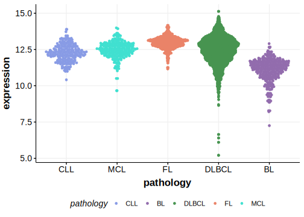

# IL16

## Overview
The IL16 gene, which encodes a pro-inflammatory cytokine, plays a role in immune responses. IL-16 is highly expressed in the activated B-cell-like (ABC) subtype of DLBCL compared to the germinal center B-cell-like (GCB) subtype. The role of mutations in lymphomagenesis is not understood. Overall, the mutation rate of IL16 is relatively low in DLBCL. *Without further support, this gene may be migrated to Tier 2.* 
## History

## Relevance tier by entity

|Entity|Tier|Description               |
|:------:|:----:|--------------------------|
| |1   |high-confidence DLBCL gene|

## Mutation incidence in large patient cohorts (GAMBL reanalysis)

|Entity|source        |frequency (%)|
|:------:|:--------------:|:-------------:|
|DLBCL |GAMBL genomes |2.29         |
|DLBCL |Schmitz cohort|3.83         |
|DLBCL |Reddy cohort  |2.80         |
|DLBCL |Chapuy cohort |5.13         |

## Mutation pattern and selective pressure estimates

[[include:dnds_IL16.md]]

View coding variants in ProteinPaint [hg19](https://morinlab.github.io/LLMPP/GAMBL/IL16_protein.html)  or [hg38](https://morinlab.github.io/LLMPP/GAMBL/IL16_protein_hg38.html)

View all variants in GenomePaint [hg19](https://morinlab.github.io/LLMPP/GAMBL/IL16.html)  or [hg38](https://morinlab.github.io/LLMPP/GAMBL/IL16_hg38.html)

## IL16 Expression

<!-- FLAGGED FOR TIER 2 -->

<!-- ORIGIN: Unknown -->

## References
